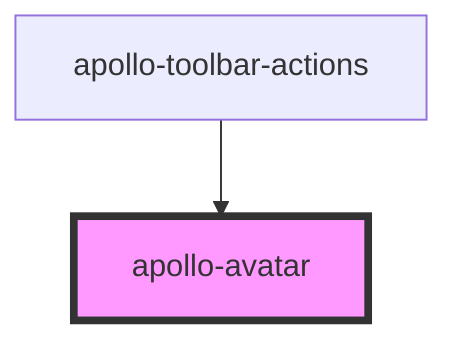

<!-- # apollo-avatar


```html
<apollo-avatar size="medium" border="none" radius="full" src="" alt="test" />
```

<br /><br /> -->

<!-- Auto Generated Below -->


## Properties

| Property | Attribute | Description             | Type                                                     | Default    |
| -------- | --------- | ----------------------- | -------------------------------------------------------- | ---------- |
| `alt`    | `alt`     | Alt da imagem do avatar | `string`                                                 | `''`       |
| `border` | `border`  | Borda do avatar         | `"light" \| "medium" \| "none" \| "strong"`              | `'light'`  |
| `radius` | `radius`  | Radius do avatar        | `"full" \| "light" \| "medium" \| "none" \| "strong"`    | `'full'`   |
| `size`   | `size`    | Tamanho do avatar       | `"large" \| "medium" \| "small" \| "xlarge" \| "xsmall"` | `'medium'` |
| `src`    | `src`     | Imagem do avatar        | `string`                                                 | `''`       |


## Dependencies

### Used by

 - [apollo-toolbar-actions](../surfaces/toolbar/actions)

### Graph


----------------------------------------------

PicPay Doc
