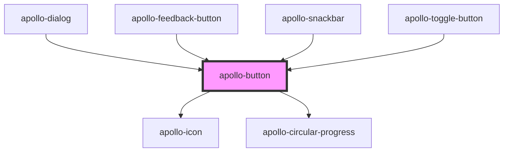

# apollo-button

<!-- Auto Generated Below -->

## Properties

| Property   | Attribute  | Description                                                        | Type                                               | Default        |
| ---------- | ---------- | ------------------------------------------------------------------ | -------------------------------------------------- | -------------- |
| `block`    | `block`    | Botão em bloco                                                     | `boolean`                                          | `false`        |
| `danger`   | `danger`   | Botão no formato danger                                            | `boolean`                                          | `false`        |
| `disabled` | `disabled` | Desabilita o botão                                                 | `boolean`                                          | `false`        |
| `href`     | `href`     | Página de destino quando clicado                                   | `string`                                           | `undefined`    |
| `loading`  | `loading`  | Habilita o loading no botão                                        | `boolean`                                          | `undefined`    |
| `name`     | `name`     | Referência do name nativo                                          | `string`                                           | `undefined`    |
| `ripple`   | `ripple`   | Feedback tátil                                                     | `boolean`                                          | `true`         |
| `round`    | `round`    | Botão redondo                                                      | `boolean`                                          | `true`         |
| `size`     | `size`     | Tamanho do botão                                                   | `"md" \| "sm"`                                     | `'sm'`         |
| `target`   | `target`   | Define se a URL passada no href vai ser aberta na mesma aba ou não | `"_blank" \| "_self"`                              | `'_blank'`     |
| `type`     | `type`     | Referência do type nativo                                          | `"button" \| "menu" \| "reset" \| "submit"`        | `'button'`     |
| `value`    | `value`    | Referência do value nativo                                         | `string`                                           | `undefined`    |
| `variant`  | `variant`  | O estilo do botão                                                  | `"link" \| "outlined" \| "raised" \| "unelevated"` | `'unelevated'` |

## Methods

### `setLoading(loading: boolean) => Promise<void>`

API para alterar o loading do button

#### Returns

Type: `Promise<void>`

## Dependencies

### Used by

 - [apollo-dialog](../dialog)
 - [apollo-feedback-button](../feedback-button)
 - [apollo-snackbar](../snackbar)
 - [apollo-toggle-button](../toggle-button)

### Depends on

- [apollo-icon](../icon)
- [apollo-circular-progress](../circular-progress)

### Graph

----------------------------------------------

PicPay Doc
