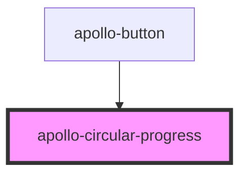

# apollo-circular-progress

<!-- Auto Generated Below -->

## Properties

| Property      | Attribute     | Description                            | Type      | Default |
| ------------- | ------------- | -------------------------------------- | --------- | ------- |
| `determinate` | `determinate` | Deixa o componente em estado fixo      | `boolean` | `false` |
| `invert`      | `invert`      | Aplica a cor branca na linha           | `boolean` | `false` |
| `label`       | `label`       | Texto de ajuda para acessibilidade     | `string`  | `''`    |
| `progress`    | `progress`    | Tamanho do progresso. Min: 0 \| Max: 1 | `number`  | `1`     |
| `radius`      | `radius`      | Raio do circulo                        | `number`  | `8.75`  |
| `stroke`      | `stroke`      | Largura da linha                       | `number`  | `2.5`   |

## Methods

### `setDeterminate(determinate: boolean) => Promise<void>`

API para deixar o estado fixo ou não

#### Returns

Type: `Promise<void>`

### `setProgress(progress: number) => Promise<void>`

API para setar o progresso do circulo

#### Returns

Type: `Promise<void>`

## Dependencies

### Used by

 - [apollo-button](../button)

### Graph

----------------------------------------------

PicPay Doc
