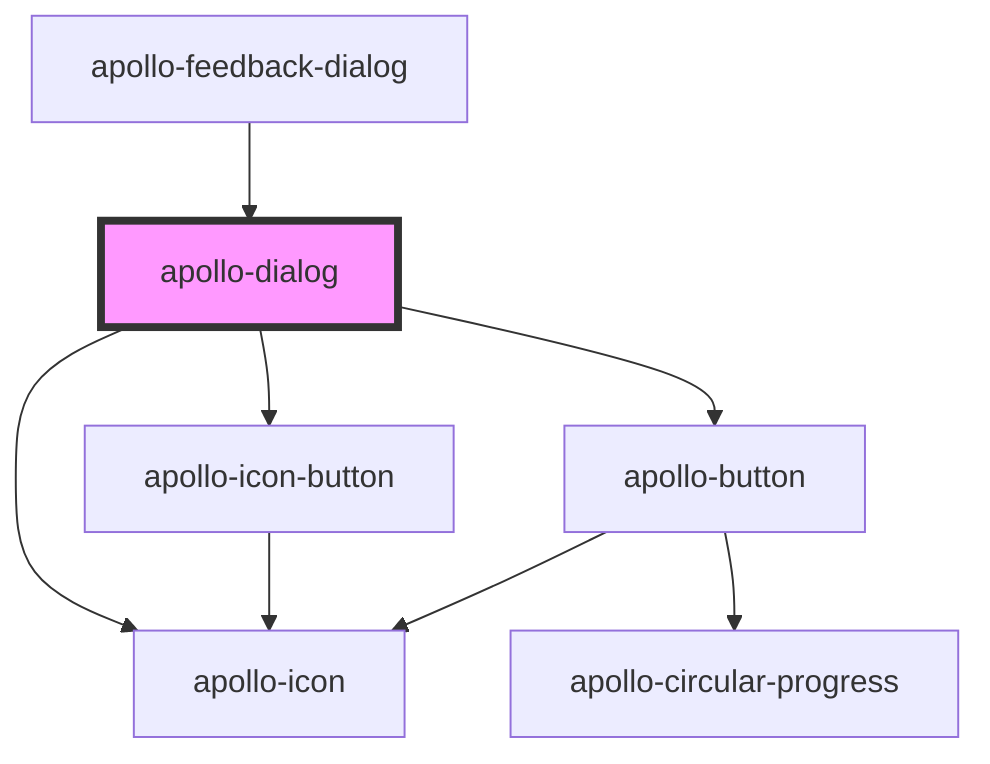

# apollo-dialog

<!-- Auto Generated Below -->

## Properties

| Property             | Attribute              | Description                                      | Type     | Default     |
| -------------------- | ---------------------- | ------------------------------------------------ | -------- | ----------- |
| `cancelButtonLabel`  | `cancel-button-label`  | Label do botão cancelar                          | `string` | `undefined` |
| `confirmButtonLabel` | `confirm-button-label` | Label do botão confirmar                         | `string` | `undefined` |
| `dialogSubtitle`     | `dialog-subtitle`      | Subtitulo do dialog                              | `string` | `undefined` |
| `dialogTitle`        | `dialog-title`         | Título do dialog                                 | `string` | `undefined` |
| `figure`             | `figure`               | Seta a versão Large do ícone para devices mobile | `string` | `undefined` |
| `icon`               | `icon`                 | Ícone da dialog                                  | `string` | `undefined` |

## Events

| Event                | Description                                            | Type                      |
| -------------------- | ------------------------------------------------------ | ------------------------- |
| `cancelButtonClick`  | Evento disparado quando o botão de cancel for clicado  | `CustomEvent<MouseEvent>` |
| `confirmButtonClick` | Evento disparado quando o botão de confirm for clicado | `CustomEvent<MouseEvent>` |

## Methods

### `close() => Promise<void>`

API para fechar o dialog

#### Returns

Type: `Promise<void>`

### `open() => Promise<void>`

API para abrir o dialog

#### Returns

Type: `Promise<void>`

## Dependencies

### Used by

 - [apollo-feedback-dialog](../feedback-dialog)

### Depends on

- [apollo-icon](../icon)
- [apollo-icon-button](../icon-button)
- [apollo-button](../button)

### Graph

----------------------------------------------

PicPay Doc
