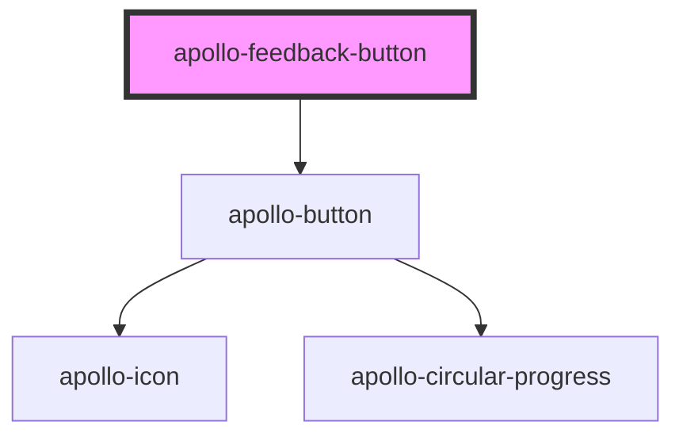

# apollo-feedback-button

<!-- Auto Generated Below -->

## Properties

| Property         | Attribute          | Description                                           | Type           | Default     |
| ---------------- | ------------------ | ----------------------------------------------------- | -------------- | ----------- |
| `checked`        | `checked`          | Estado do botão                                       | `boolean`      | `false`     |
| `delay`          | `delay`            | Aplica um delay para o botão voltar ao estado inicial | `number`       | `1.6`       |
| `size`           | `size`             | Tamanho do botão                                      | `"md" \| "sm"` | `'sm'`      |
| `toggleOffLabel` | `toggle-off-label` | Label do botão com estado de toggle off               | `string`       | `undefined` |
| `toggleOnLabel`  | `toggle-on-label`  | Label do botão com estado de toggle on                | `string`       | `undefined` |

## Events

| Event          | Description                                 | Type                      |
| -------------- | ------------------------------------------- | ------------------------- |
| `toggleChange` | Evento disparado quando o toggle é clickado | `CustomEvent<MouseEvent>` |

## Methods

### `setChecked(checked: boolean) => Promise<void>`

API para alterar o toggle

#### Returns

Type: `Promise<void>`

### `startFeedbackTimeout(delay: number) => Promise<unknown>`

API para chamar a animação de feedback

#### Returns

Type: `Promise<unknown>`

## Dependencies

### Depends on

- [apollo-button](../button)

### Graph

----------------------------------------------

PicPay Doc
