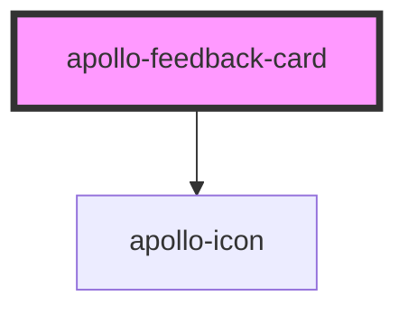

# apollo-feedback-card

<!-- Auto Generated Below -->

## Properties

| Property   | Attribute  | Description                      | Type                                       | Default     |
| ---------- | ---------- | -------------------------------- | ------------------------------------------ | ----------- |
| `emphasis` | `emphasis` | Ativa ênfase no card             | `boolean`                                  | `undefined` |
| `label`    | `label`    | Label do card                    | `string`                                   | `undefined` |
| `stacked`  | `stacked`  | Renderiza o card no modo stacked | `boolean`                                  | `false`     |
| `type`     | `type`     | Tipo do card                     | `"done" \| "error" \| "info" \| "warning"` | `'done'`    |

## Dependencies

### Depends on

- [apollo-icon](../icon)

### Graph

----------------------------------------------

PicPay Doc
