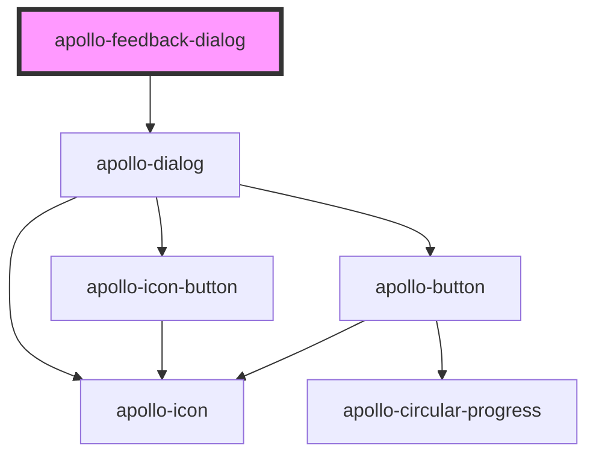

# apollo-dialog

<!-- Auto Generated Below -->

## Properties

| Property                    | Attribute                       | Description                                      | Type                                       | Default     |
| --------------------------- | ------------------------------- | ------------------------------------------------ | ------------------------------------------ | ----------- |
| `cancelButtonLabel`         | `cancel-button-label`           | Label do botão cancelar                          | `string`                                   | `undefined` |
| `confirmButtonLabel`        | `confirm-button-label`          | Label do botão confirmar                         | `string`                                   | `undefined` |
| `dialogSubtitle`            | `dialog-subtitle`               | Subtitulo do dialog                              | `string`                                   | `undefined` |
| `dialogTitle`               | `dialog-title`                  | Título do dialog                                 | `string`                                   | `undefined` |
| `type`                      | `type`                          | Tipo do dialog                                   | `"done" \| "error" \| "info" \| "warning"` | `undefined` |
| `useFigureVersionForMobile` | `use-figure-version-for-mobile` | Seta a versão Large do ícone para devices mobile | `boolean`                                  | `false`     |

## Events

| Event                        | Description                                            | Type                            |
| ---------------------------- | ------------------------------------------------------ | ------------------------------- |
| `cancelFeedbackButtonClick`  | Evento disparado quando o botão de cancel for clicado  | `CustomEvent<CustomEvent<any>>` |
| `confirmFeedbackButtonClick` | Evento disparado quando o botão de confirm for clicado | `CustomEvent<CustomEvent<any>>` |

## Methods

### `close() => Promise<void>`

API para fechar o dialog

#### Returns

Type: `Promise<void>`

### `open() => Promise<void>`

API para abrir o dialog

#### Returns

Type: `Promise<void>`

## Dependencies

### Depends on

- [apollo-dialog](../dialog)

### Graph

----------------------------------------------

PicPay Doc
