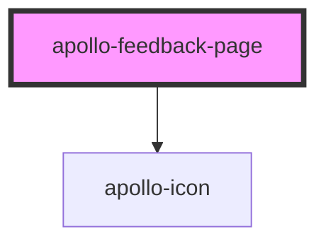

# apollo-feedback-page

<!-- Auto Generated Below -->

## Properties

| Property       | Attribute       | Description                | Type                                       | Default     |
| -------------- | --------------- | -------------------------- | ------------------------------------------ | ----------- |
| `pageSubtitle` | `page-subtitle` | Subtítulo da feedback page | `string`                                   | `undefined` |
| `pageTitle`    | `page-title`    | Título da feedback page    | `string`                                   | `undefined` |
| `type`         | `type`          | Tipo da feedback page      | `"done" \| "error" \| "info" \| "warning"` | `undefined` |
| `useFigure`    | `use-figure`    | Seta a versão Figure       | `boolean`                                  | `false`     |

## Dependencies

### Depends on

- [apollo-icon](../icon)

### Graph

----------------------------------------------

PicPay Doc
