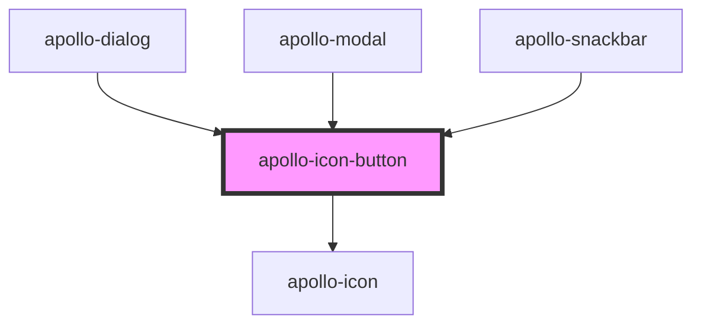

# apollo-icon-button

<!-- Auto Generated Below -->

## Properties

| Property   | Attribute   | Description                         | Type           | Default           |
| ---------- | ----------- | ----------------------------------- | -------------- | ----------------- |
| `checked`  | `checked`   | checked                             | `boolean`      | `false`           |
| `color`    | `color`     | color                               | `string`       | `''`              |
| `disabled` | `disabled`  | disabled                            | `boolean`      | `false`           |
| `icon`     | `icon`      | icon                                | `string`       | `''`              |
| `iconOff`  | `icon-off`  | iconOff                             | `string`       | `''`              |
| `iconOn`   | `icon-on`   | iconOn                              | `string`       | `''`              |
| `iconPack` | `icon-pack` | iconPack                            | `string`       | `'material-icon'` |
| `invalid`  | `invalid`   | Habilita o estado inválido do input | `boolean`      | `false`           |
| `labelOff` | `label-off` | labelOff                            | `string`       | `''`              |
| `labelOn`  | `label-on`  | labelOn                             | `string`       | `''`              |
| `pid`      | `pid`       | pid                                 | `string`       | `''`              |
| `size`     | `size`      | size                                | `"md" \| "sm"` | `'md'`            |

## Events

| Event          | Description                                        | Type                   |
| -------------- | -------------------------------------------------- | ---------------------- |
| `apolloBlur`   | Evento disparado quando o componente perde o foco  | `CustomEvent<null>`    |
| `apolloChange` | Evento disparado quando o valor do componente muda | `CustomEvent<boolean>` |

## Dependencies

### Used by

 - [apollo-dialog](../dialog)
 - [apollo-modal](../modal)
 - [apollo-snackbar](../snackbar)

### Depends on

- [apollo-icon](../icon)

### Graph

----------------------------------------------

PicPay Doc
