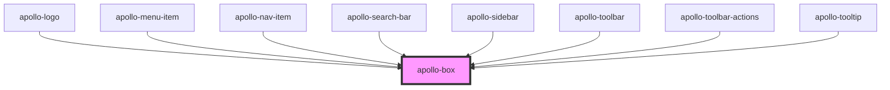

# apollo-box

<!-- Auto Generated Below -->

## Properties

| Property                  | Attribute                    | Description                                                                                | Type                                                                                                                                                                                                                                                                                                                                                                                                                                                                                                                                                                                                                                                                                                                                                                                                                                                                                                                                                                                                                                                                                                                                                                                                                                                                                                                                                                                                                                                                                                                                                                                                                                     | Default     |
| ------------------------- | ---------------------------- | ------------------------------------------------------------------------------------------ | ---------------------------------------------------------------------------------------------------------------------------------------------------------------------------------------------------------------------------------------------------------------------------------------------------------------------------------------------------------------------------------------------------------------------------------------------------------------------------------------------------------------------------------------------------------------------------------------------------------------------------------------------------------------------------------------------------------------------------------------------------------------------------------------------------------------------------------------------------------------------------------------------------------------------------------------------------------------------------------------------------------------------------------------------------------------------------------------------------------------------------------------------------------------------------------------------------------------------------------------------------------------------------------------------------------------------------------------------------------------------------------------------------------------------------------------------------------------------------------------------------------------------------------------------------------------------------------------------------------------------------------------- | ----------- |
| `alignItems`              | `align-items`                | Abreviação de prop no estilo `alignItems`                                                  | `"center" \| "flex-end" \| "flex-start" \| { base?: "flex-start" \| "center" \| "flex-end"; xs?: "flex-start" \| "center" \| "flex-end"; sm?: "flex-start" \| "center" \| "flex-end"; md?: "flex-start" \| "center" \| "flex-end"; lg?: "flex-start" \| "center" \| "flex-end"; }`                                                                                                                                                                                                                                                                                                                                                                                                                                                                                                                                                                                                                                                                                                                                                                                                                                                                                                                                                                                                                                                                                                                                                                                                                                                                                                                                                       | `undefined` |
| `backgroundColor`         | `background-color`           | Abreviação de propriedade de estilo `backgroundColor`                                      | `string \| { base?: string; xs?: string; sm?: string; md?: string; lg?: string; }`                                                                                                                                                                                                                                                                                                                                                                                                                                                                                                                                                                                                                                                                                                                                                                                                                                                                                                                                                                                                                                                                                                                                                                                                                                                                                                                                                                                                                                                                                                                                                       | `undefined` |
| `bg`                      | `bg`                         | Abreviação de propriedade de estilo `backgroundColor`                                      | `string \| { base?: string; xs?: string; sm?: string; md?: string; lg?: string; }`                                                                                                                                                                                                                                                                                                                                                                                                                                                                                                                                                                                                                                                                                                                                                                                                                                                                                                                                                                                                                                                                                                                                                                                                                                                                                                                                                                                                                                                                                                                                                       | `undefined` |
| `border`                  | `border`                     | Abreviação de propriedade de estilo `borderWidth`                                          | `"light" \| "medium" \| "none" \| "strong" \| { base?: "none" \| "light" \| "medium" \| "strong"; xs?: "none" \| "light" \| "medium" \| "strong"; sm?: "none" \| "light" \| "medium" \| "strong"; md?: "none" \| "light" \| "medium" \| "strong"; lg?: "none" \| "light" \| "medium" \| "strong"; }`                                                                                                                                                                                                                                                                                                                                                                                                                                                                                                                                                                                                                                                                                                                                                                                                                                                                                                                                                                                                                                                                                                                                                                                                                                                                                                                                     | `undefined` |
| `borderBottom`            | `border-bottom`              | Abreviação de propriedade de estilo `borderBottom`                                         | `"light" \| "medium" \| "none" \| "strong" \| { base?: "none" \| "light" \| "medium" \| "strong"; xs?: "none" \| "light" \| "medium" \| "strong"; sm?: "none" \| "light" \| "medium" \| "strong"; md?: "none" \| "light" \| "medium" \| "strong"; lg?: "none" \| "light" \| "medium" \| "strong"; }`                                                                                                                                                                                                                                                                                                                                                                                                                                                                                                                                                                                                                                                                                                                                                                                                                                                                                                                                                                                                                                                                                                                                                                                                                                                                                                                                     | `undefined` |
| `borderBottomColor`       | `border-bottom-color`        | Abreviação de propriedade de estilo `borderBottomColor`                                    | `string \| { base?: string; xs?: string; sm?: string; md?: string; lg?: string; }`                                                                                                                                                                                                                                                                                                                                                                                                                                                                                                                                                                                                                                                                                                                                                                                                                                                                                                                                                                                                                                                                                                                                                                                                                                                                                                                                                                                                                                                                                                                                                       | `undefined` |
| `borderBottomLeftRadius`  | `border-bottom-left-radius`  | Abreviação de propriedade de estilo `borderBottomLeftBottom`                               | `"full" \| "light" \| "medium" \| "none" \| "pill" \| "strong" \| { base?: "none" \| "light" \| "medium" \| "strong" \| "pill" \| "full"; xs?: "none" \| "light" \| "medium" \| "strong" \| "pill" \| "full"; sm?: "none" \| "light" \| "medium" \| "strong" \| "pill" \| "full"; md?: "none" \| "light" \| "medium" \| "strong" \| "pill" \| "full"; lg?: "none" \| "light" \| "medium" \| "strong" \| "pill" \| "full"; }`                                                                                                                                                                                                                                                                                                                                                                                                                                                                                                                                                                                                                                                                                                                                                                                                                                                                                                                                                                                                                                                                                                                                                                                                             | `undefined` |
| `borderBottomRadius`      | `border-bottom-radius`       | Abreviação de propriedade de estilo `borderBottomRightRadius` and `borderBottomLeftRadius` | `"full" \| "light" \| "medium" \| "none" \| "pill" \| "strong" \| { base?: "none" \| "light" \| "medium" \| "strong" \| "pill" \| "full"; xs?: "none" \| "light" \| "medium" \| "strong" \| "pill" \| "full"; sm?: "none" \| "light" \| "medium" \| "strong" \| "pill" \| "full"; md?: "none" \| "light" \| "medium" \| "strong" \| "pill" \| "full"; lg?: "none" \| "light" \| "medium" \| "strong" \| "pill" \| "full"; }`                                                                                                                                                                                                                                                                                                                                                                                                                                                                                                                                                                                                                                                                                                                                                                                                                                                                                                                                                                                                                                                                                                                                                                                                             | `undefined` |
| `borderBottomRightRadius` | `border-bottom-right-radius` | Abreviação de propriedade de estilo `borderBottomRightRadius`                              | `"full" \| "light" \| "medium" \| "none" \| "pill" \| "strong" \| { base?: "none" \| "light" \| "medium" \| "strong" \| "pill" \| "full"; xs?: "none" \| "light" \| "medium" \| "strong" \| "pill" \| "full"; sm?: "none" \| "light" \| "medium" \| "strong" \| "pill" \| "full"; md?: "none" \| "light" \| "medium" \| "strong" \| "pill" \| "full"; lg?: "none" \| "light" \| "medium" \| "strong" \| "pill" \| "full"; }`                                                                                                                                                                                                                                                                                                                                                                                                                                                                                                                                                                                                                                                                                                                                                                                                                                                                                                                                                                                                                                                                                                                                                                                                             | `undefined` |
| `borderBottomWidth`       | `border-bottom-width`        | Abreviação de propriedade de estilo `borderBottomWidth`                                    | `"light" \| "medium" \| "none" \| "strong" \| { base?: "none" \| "light" \| "medium" \| "strong"; xs?: "none" \| "light" \| "medium" \| "strong"; sm?: "none" \| "light" \| "medium" \| "strong"; md?: "none" \| "light" \| "medium" \| "strong"; lg?: "none" \| "light" \| "medium" \| "strong"; }`                                                                                                                                                                                                                                                                                                                                                                                                                                                                                                                                                                                                                                                                                                                                                                                                                                                                                                                                                                                                                                                                                                                                                                                                                                                                                                                                     | `undefined` |
| `borderColor`             | `border-color`               | Abreviação de propriedade de estilo `borderColor`                                          | `string \| { base?: string; xs?: string; sm?: string; md?: string; lg?: string; }`                                                                                                                                                                                                                                                                                                                                                                                                                                                                                                                                                                                                                                                                                                                                                                                                                                                                                                                                                                                                                                                                                                                                                                                                                                                                                                                                                                                                                                                                                                                                                       | `undefined` |
| `borderLeft`              | `border-left`                | Abreviação de propriedade de estilo `borderLeft`                                           | `"light" \| "medium" \| "none" \| "strong" \| { base?: "none" \| "light" \| "medium" \| "strong"; xs?: "none" \| "light" \| "medium" \| "strong"; sm?: "none" \| "light" \| "medium" \| "strong"; md?: "none" \| "light" \| "medium" \| "strong"; lg?: "none" \| "light" \| "medium" \| "strong"; }`                                                                                                                                                                                                                                                                                                                                                                                                                                                                                                                                                                                                                                                                                                                                                                                                                                                                                                                                                                                                                                                                                                                                                                                                                                                                                                                                     | `undefined` |
| `borderLeftColor`         | `border-left-color`          | Abreviação de propriedade de estilo `borderLeftColor`                                      | `string \| { base?: string; xs?: string; sm?: string; md?: string; lg?: string; }`                                                                                                                                                                                                                                                                                                                                                                                                                                                                                                                                                                                                                                                                                                                                                                                                                                                                                                                                                                                                                                                                                                                                                                                                                                                                                                                                                                                                                                                                                                                                                       | `undefined` |
| `borderLeftRadius`        | `border-left-radius`         | Abreviação de propriedade de estilo `borderTopLeftRadius` and `borderBottomLeftRadius`     | `"full" \| "light" \| "medium" \| "none" \| "pill" \| "strong" \| { base?: "none" \| "light" \| "medium" \| "strong" \| "pill" \| "full"; xs?: "none" \| "light" \| "medium" \| "strong" \| "pill" \| "full"; sm?: "none" \| "light" \| "medium" \| "strong" \| "pill" \| "full"; md?: "none" \| "light" \| "medium" \| "strong" \| "pill" \| "full"; lg?: "none" \| "light" \| "medium" \| "strong" \| "pill" \| "full"; }`                                                                                                                                                                                                                                                                                                                                                                                                                                                                                                                                                                                                                                                                                                                                                                                                                                                                                                                                                                                                                                                                                                                                                                                                             | `undefined` |
| `borderLeftWidth`         | `border-left-width`          | Abreviação de propriedade de estilo `borderLeftWidth`                                      | `"light" \| "medium" \| "none" \| "strong" \| { base?: "none" \| "light" \| "medium" \| "strong"; xs?: "none" \| "light" \| "medium" \| "strong"; sm?: "none" \| "light" \| "medium" \| "strong"; md?: "none" \| "light" \| "medium" \| "strong"; lg?: "none" \| "light" \| "medium" \| "strong"; }`                                                                                                                                                                                                                                                                                                                                                                                                                                                                                                                                                                                                                                                                                                                                                                                                                                                                                                                                                                                                                                                                                                                                                                                                                                                                                                                                     | `undefined` |
| `borderRadius`            | `border-radius`              | Abreviação de propriedade de estilo `borderRadius`                                         | `"full" \| "light" \| "medium" \| "none" \| "pill" \| "strong" \| { base?: "none" \| "light" \| "medium" \| "strong" \| "pill" \| "full"; xs?: "none" \| "light" \| "medium" \| "strong" \| "pill" \| "full"; sm?: "none" \| "light" \| "medium" \| "strong" \| "pill" \| "full"; md?: "none" \| "light" \| "medium" \| "strong" \| "pill" \| "full"; lg?: "none" \| "light" \| "medium" \| "strong" \| "pill" \| "full"; }`                                                                                                                                                                                                                                                                                                                                                                                                                                                                                                                                                                                                                                                                                                                                                                                                                                                                                                                                                                                                                                                                                                                                                                                                             | `undefined` |
| `borderRight`             | `border-right`               | Abreviação de propriedade de estilo `borderRight`                                          | `"light" \| "medium" \| "none" \| "strong" \| { base?: "none" \| "light" \| "medium" \| "strong"; xs?: "none" \| "light" \| "medium" \| "strong"; sm?: "none" \| "light" \| "medium" \| "strong"; md?: "none" \| "light" \| "medium" \| "strong"; lg?: "none" \| "light" \| "medium" \| "strong"; }`                                                                                                                                                                                                                                                                                                                                                                                                                                                                                                                                                                                                                                                                                                                                                                                                                                                                                                                                                                                                                                                                                                                                                                                                                                                                                                                                     | `undefined` |
| `borderRightColor`        | `border-right-color`         | Abreviação de propriedade de estilo `borderRightColor`                                     | `string \| { base?: string; xs?: string; sm?: string; md?: string; lg?: string; }`                                                                                                                                                                                                                                                                                                                                                                                                                                                                                                                                                                                                                                                                                                                                                                                                                                                                                                                                                                                                                                                                                                                                                                                                                                                                                                                                                                                                                                                                                                                                                       | `undefined` |
| `borderRightRadius`       | `border-right-radius`        | Abreviação de propriedade de estilo `borderTopRightRadius` and `borderBottomRightRadius`   | `"full" \| "light" \| "medium" \| "none" \| "pill" \| "strong" \| { base?: "none" \| "light" \| "medium" \| "strong" \| "pill" \| "full"; xs?: "none" \| "light" \| "medium" \| "strong" \| "pill" \| "full"; sm?: "none" \| "light" \| "medium" \| "strong" \| "pill" \| "full"; md?: "none" \| "light" \| "medium" \| "strong" \| "pill" \| "full"; lg?: "none" \| "light" \| "medium" \| "strong" \| "pill" \| "full"; }`                                                                                                                                                                                                                                                                                                                                                                                                                                                                                                                                                                                                                                                                                                                                                                                                                                                                                                                                                                                                                                                                                                                                                                                                             | `undefined` |
| `borderRightWidth`        | `border-right-width`         | Abreviação de propriedade de estilo `borderRightWidth`                                     | `"light" \| "medium" \| "none" \| "strong" \| { base?: "none" \| "light" \| "medium" \| "strong"; xs?: "none" \| "light" \| "medium" \| "strong"; sm?: "none" \| "light" \| "medium" \| "strong"; md?: "none" \| "light" \| "medium" \| "strong"; lg?: "none" \| "light" \| "medium" \| "strong"; }`                                                                                                                                                                                                                                                                                                                                                                                                                                                                                                                                                                                                                                                                                                                                                                                                                                                                                                                                                                                                                                                                                                                                                                                                                                                                                                                                     | `undefined` |
| `borderTop`               | `border-top`                 | Abreviação de propriedade de estilo `borderTop`                                            | `"light" \| "medium" \| "none" \| "strong" \| { base?: "none" \| "light" \| "medium" \| "strong"; xs?: "none" \| "light" \| "medium" \| "strong"; sm?: "none" \| "light" \| "medium" \| "strong"; md?: "none" \| "light" \| "medium" \| "strong"; lg?: "none" \| "light" \| "medium" \| "strong"; }`                                                                                                                                                                                                                                                                                                                                                                                                                                                                                                                                                                                                                                                                                                                                                                                                                                                                                                                                                                                                                                                                                                                                                                                                                                                                                                                                     | `undefined` |
| `borderTopColor`          | `border-top-color`           | Abreviação de propriedade de estilo `borderTopColor`                                       | `string \| { base?: string; xs?: string; sm?: string; md?: string; lg?: string; }`                                                                                                                                                                                                                                                                                                                                                                                                                                                                                                                                                                                                                                                                                                                                                                                                                                                                                                                                                                                                                                                                                                                                                                                                                                                                                                                                                                                                                                                                                                                                                       | `undefined` |
| `borderTopLeftRadius`     | `border-top-left-radius`     | Abreviação de propriedade de estilo `borderTopLeftRadius`                                  | `"full" \| "light" \| "medium" \| "none" \| "pill" \| "strong" \| { base?: "none" \| "light" \| "medium" \| "strong" \| "pill" \| "full"; xs?: "none" \| "light" \| "medium" \| "strong" \| "pill" \| "full"; sm?: "none" \| "light" \| "medium" \| "strong" \| "pill" \| "full"; md?: "none" \| "light" \| "medium" \| "strong" \| "pill" \| "full"; lg?: "none" \| "light" \| "medium" \| "strong" \| "pill" \| "full"; }`                                                                                                                                                                                                                                                                                                                                                                                                                                                                                                                                                                                                                                                                                                                                                                                                                                                                                                                                                                                                                                                                                                                                                                                                             | `undefined` |
| `borderTopRadius`         | `border-top-radius`          | Abreviação de propriedade de estilo `borderTopLeftRadius` and `borderTopRightRadius`       | `"full" \| "light" \| "medium" \| "none" \| "pill" \| "strong" \| { base?: "none" \| "light" \| "medium" \| "strong" \| "pill" \| "full"; xs?: "none" \| "light" \| "medium" \| "strong" \| "pill" \| "full"; sm?: "none" \| "light" \| "medium" \| "strong" \| "pill" \| "full"; md?: "none" \| "light" \| "medium" \| "strong" \| "pill" \| "full"; lg?: "none" \| "light" \| "medium" \| "strong" \| "pill" \| "full"; }`                                                                                                                                                                                                                                                                                                                                                                                                                                                                                                                                                                                                                                                                                                                                                                                                                                                                                                                                                                                                                                                                                                                                                                                                             | `undefined` |
| `borderTopRightRadius`    | `border-top-right-radius`    | Abreviação de propriedade de estilo `borderTopRightRadius`                                 | `"full" \| "light" \| "medium" \| "none" \| "pill" \| "strong" \| { base?: "none" \| "light" \| "medium" \| "strong" \| "pill" \| "full"; xs?: "none" \| "light" \| "medium" \| "strong" \| "pill" \| "full"; sm?: "none" \| "light" \| "medium" \| "strong" \| "pill" \| "full"; md?: "none" \| "light" \| "medium" \| "strong" \| "pill" \| "full"; lg?: "none" \| "light" \| "medium" \| "strong" \| "pill" \| "full"; }`                                                                                                                                                                                                                                                                                                                                                                                                                                                                                                                                                                                                                                                                                                                                                                                                                                                                                                                                                                                                                                                                                                                                                                                                             | `undefined` |
| `borderTopWidth`          | `border-top-width`           | Abreviação de propriedade de estilo `borderTopWidth`                                       | `"light" \| "medium" \| "none" \| "strong" \| { base?: "none" \| "light" \| "medium" \| "strong"; xs?: "none" \| "light" \| "medium" \| "strong"; sm?: "none" \| "light" \| "medium" \| "strong"; md?: "none" \| "light" \| "medium" \| "strong"; lg?: "none" \| "light" \| "medium" \| "strong"; }`                                                                                                                                                                                                                                                                                                                                                                                                                                                                                                                                                                                                                                                                                                                                                                                                                                                                                                                                                                                                                                                                                                                                                                                                                                                                                                                                     | `undefined` |
| `borderWidth`             | `border-width`               | Abreviação de propriedade de estilo `borderWidth`                                          | `"light" \| "medium" \| "none" \| "strong" \| { base?: "none" \| "light" \| "medium" \| "strong"; xs?: "none" \| "light" \| "medium" \| "strong"; sm?: "none" \| "light" \| "medium" \| "strong"; md?: "none" \| "light" \| "medium" \| "strong"; lg?: "none" \| "light" \| "medium" \| "strong"; }`                                                                                                                                                                                                                                                                                                                                                                                                                                                                                                                                                                                                                                                                                                                                                                                                                                                                                                                                                                                                                                                                                                                                                                                                                                                                                                                                     | `undefined` |
| `borderX`                 | `border-x`                   | Abreviação de propriedade de estilo `borderLeft` and `borderRight`                         | `"light" \| "medium" \| "none" \| "strong" \| { base?: "none" \| "light" \| "medium" \| "strong"; xs?: "none" \| "light" \| "medium" \| "strong"; sm?: "none" \| "light" \| "medium" \| "strong"; md?: "none" \| "light" \| "medium" \| "strong"; lg?: "none" \| "light" \| "medium" \| "strong"; }`                                                                                                                                                                                                                                                                                                                                                                                                                                                                                                                                                                                                                                                                                                                                                                                                                                                                                                                                                                                                                                                                                                                                                                                                                                                                                                                                     | `undefined` |
| `borderY`                 | `border-y`                   | Abreviação de propriedade de estilo `borderTop` and `borderBottom`                         | `"light" \| "medium" \| "none" \| "strong" \| { base?: "none" \| "light" \| "medium" \| "strong"; xs?: "none" \| "light" \| "medium" \| "strong"; sm?: "none" \| "light" \| "medium" \| "strong"; md?: "none" \| "light" \| "medium" \| "strong"; lg?: "none" \| "light" \| "medium" \| "strong"; }`                                                                                                                                                                                                                                                                                                                                                                                                                                                                                                                                                                                                                                                                                                                                                                                                                                                                                                                                                                                                                                                                                                                                                                                                                                                                                                                                     | `undefined` |
| `boxShadow`               | `box-shadow`                 | Abreviação de propriedade de estilo `boxShadow`                                            | `"light" \| "medium" \| "strong" \| { base?: "light" \| "medium" \| "strong"; xs?: "light" \| "medium" \| "strong"; sm?: "light" \| "medium" \| "strong"; md?: "light" \| "medium" \| "strong"; lg?: "light" \| "medium" \| "strong"; }`                                                                                                                                                                                                                                                                                                                                                                                                                                                                                                                                                                                                                                                                                                                                                                                                                                                                                                                                                                                                                                                                                                                                                                                                                                                                                                                                                                                                 | `undefined` |
| `color`                   | `color`                      | Abreviação de propriedade de estilo `color`                                                | `string \| { base?: string; xs?: string; sm?: string; md?: string; lg?: string; }`                                                                                                                                                                                                                                                                                                                                                                                                                                                                                                                                                                                                                                                                                                                                                                                                                                                                                                                                                                                                                                                                                                                                                                                                                                                                                                                                                                                                                                                                                                                                                       | `undefined` |
| `display`                 | `display`                    | Abreviação de propriedade de estilo `display`                                              | `string \| { base?: string; xs?: string; sm?: string; md?: string; lg?: string; }`                                                                                                                                                                                                                                                                                                                                                                                                                                                                                                                                                                                                                                                                                                                                                                                                                                                                                                                                                                                                                                                                                                                                                                                                                                                                                                                                                                                                                                                                                                                                                       | `undefined` |
| `fontSize`                | `font-size`                  | Abreviação de propriedade de estilo `fontSize`                                             | `"2xl" \| "3xl" \| "4xl" \| "5xl" \| "6xl" \| "7xl" \| "base" \| "lg" \| "sm" \| "xl" \| "xs" \| { base?: "base" \| "xs" \| "sm" \| "lg" \| "xl" \| "2xl" \| "3xl" \| "4xl" \| "5xl" \| "6xl" \| "7xl"; xs?: "base" \| "xs" \| "sm" \| "lg" \| "xl" \| "2xl" \| "3xl" \| "4xl" \| "5xl" \| "6xl" \| "7xl"; sm?: "base" \| "xs" \| "sm" \| "lg" \| "xl" \| "2xl" \| "3xl" \| "4xl" \| "5xl" \| "6xl" \| "7xl"; md?: "base" \| "xs" \| "sm" \| "lg" \| "xl" \| "2xl" \| "3xl" \| "4xl" \| "5xl" \| "6xl" \| "7xl"; lg?: "base" \| "xs" \| "sm" \| "lg" \| "xl" \| "2xl" \| "3xl" \| "4xl" \| "5xl" \| "6xl" \| "7xl"; }`                                                                                                                                                                                                                                                                                                                                                                                                                                                                                                                                                                                                                                                                                                                                                                                                                                                                                                                                                                                                                   | `undefined` |
| `fontWeight`              | `font-weight`                | Abreviação de propriedade de estilo `fontWeight`                                           | `"black" \| "bold" \| "extrabold" \| "extralight" \| "light" \| "medium" \| "normal" \| "semibold" \| "thin" \| { base?: "thin" \| "extralight" \| "light" \| "normal" \| "medium" \| "semibold" \| "bold" \| "extrabold" \| "black"; xs?: "thin" \| "extralight" \| "light" \| "normal" \| "medium" \| "semibold" \| "bold" \| "extrabold" \| "black"; sm?: "thin" \| "extralight" \| "light" \| "normal" \| "medium" \| "semibold" \| "bold" \| "extrabold" \| "black"; md?: "thin" \| "extralight" \| "light" \| "normal" \| "medium" \| "semibold" \| "bold" \| "extrabold" \| "black"; lg?: "thin" \| "extralight" \| "light" \| "normal" \| "medium" \| "semibold" \| "bold" \| "extrabold" \| "black"; }`                                                                                                                                                                                                                                                                                                                                                                                                                                                                                                                                                                                                                                                                                                                                                                                                                                                                                                                         | `undefined` |
| `height`                  | `height`                     | Abreviação de propriedade de estilo `height`                                               | `string \| { base?: string; xs?: string; sm?: string; md?: string; lg?: string; }`                                                                                                                                                                                                                                                                                                                                                                                                                                                                                                                                                                                                                                                                                                                                                                                                                                                                                                                                                                                                                                                                                                                                                                                                                                                                                                                                                                                                                                                                                                                                                       | `undefined` |
| `justify`                 | `justify`                    | Abreviação de prop de estilo `justifyContent`                                              | `"center" \| "flex-end" \| "flex-start" \| "space-around" \| "space-between" \| "space-evenly" \| { base?: "flex-start" \| "center" \| "flex-end" \| "space-between" \| "space-around" \| "space-evenly"; xs?: "flex-start" \| "center" \| "flex-end" \| "space-between" \| "space-around" \| "space-evenly"; sm?: "flex-start" \| "center" \| "flex-end" \| "space-between" \| "space-around" \| "space-evenly"; md?: "flex-start" \| "center" \| "flex-end" \| "space-between" \| "space-around" \| "space-evenly"; lg?: "flex-start" \| "center" \| "flex-end" \| "space-between" \| "space-around" \| "space-evenly"; }`                                                                                                                                                                                                                                                                                                                                                                                                                                                                                                                                                                                                                                                                                                                                                                                                                                                                                                                                                                                                             | `undefined` |
| `lineHeight`              | `line-height`                | Abreviação de propriedade de estilo `lineHeight`                                           | `"2xl" \| "3xl" \| "4xl" \| "5xl" \| "6xl" \| "7xl" \| "base" \| "lg" \| "sm" \| "xl" \| "xs" \| { base?: "base" \| "xs" \| "sm" \| "lg" \| "xl" \| "2xl" \| "3xl" \| "4xl" \| "5xl" \| "6xl" \| "7xl"; xs?: "base" \| "xs" \| "sm" \| "lg" \| "xl" \| "2xl" \| "3xl" \| "4xl" \| "5xl" \| "6xl" \| "7xl"; sm?: "base" \| "xs" \| "sm" \| "lg" \| "xl" \| "2xl" \| "3xl" \| "4xl" \| "5xl" \| "6xl" \| "7xl"; md?: "base" \| "xs" \| "sm" \| "lg" \| "xl" \| "2xl" \| "3xl" \| "4xl" \| "5xl" \| "6xl" \| "7xl"; lg?: "base" \| "xs" \| "sm" \| "lg" \| "xl" \| "2xl" \| "3xl" \| "4xl" \| "5xl" \| "6xl" \| "7xl"; }`                                                                                                                                                                                                                                                                                                                                                                                                                                                                                                                                                                                                                                                                                                                                                                                                                                                                                                                                                                                                                   | `undefined` |
| `m`                       | `m`                          | Abreviação de propriedade de estilo `margin`                                               | `"none" \| "half" \| "1" \| "2" \| "3" \| "4" \| "5" \| "6" \| "7" \| "8" \| "9" \| "10" \| "11" \| "12" \| "14" \| "16" \| "18" \| "20" \| "22" \| "24" \| "26" \| "28" \| "30" \| "32" \| "34" \| "36" \| "38" \| "40" \| "42" \| "44" \| "46" \| "48" \| "50" \| { base?: "none" \| "half" \| "1" \| "2" \| "3" \| "4" \| "5" \| "6" \| "7" \| "8" \| "9" \| "10" \| "11" \| "12" \| "14" \| "16" \| "18" \| "20" \| "22" \| "24" \| "26" \| "28" \| "30" \| "32" \| "34" \| "36" \| "38" \| "40" \| "42" \| "44" \| "46" \| "48" \| "50"; xs?: "none" \| "half" \| "1" \| "2" \| "3" \| "4" \| "5" \| "6" \| "7" \| "8" \| "9" \| "10" \| "11" \| "12" \| "14" \| "16" \| "18" \| "20" \| "22" \| "24" \| "26" \| "28" \| "30" \| "32" \| "34" \| "36" \| "38" \| "40" \| "42" \| "44" \| "46" \| "48" \| "50"; sm?: "none" \| "half" \| "1" \| "2" \| "3" \| "4" \| "5" \| "6" \| "7" \| "8" \| "9" \| "10" \| "11" \| "12" \| "14" \| "16" \| "18" \| "20" \| "22" \| "24" \| "26" \| "28" \| "30" \| "32" \| "34" \| "36" \| "38" \| "40" \| "42" \| "44" \| "46" \| "48" \| "50"; md?: "none" \| "half" \| "1" \| "2" \| "3" \| "4" \| "5" \| "6" \| "7" \| "8" \| "9" \| "10" \| "11" \| "12" \| "14" \| "16" \| "18" \| "20" \| "22" \| "24" \| "26" \| "28" \| "30" \| "32" \| "34" \| "36" \| "38" \| "40" \| "42" \| "44" \| "46" \| "48" \| "50"; lg?: "none" \| "half" \| "1" \| "2" \| "3" \| "4" \| "5" \| "6" \| "7" \| "8" \| "9" \| "10" \| "11" \| "12" \| "14" \| "16" \| "18" \| "20" \| "22" \| "24" \| "26" \| "28" \| "30" \| "32" \| "34" \| "36" \| "38" \| "40" \| "42" \| "44" \| "46" \| "48" \| "50"; }` | `undefined` |
| `margin`                  | `margin`                     | Abreviação de propriedade de estilo `margin`                                               | `"none" \| "half" \| "1" \| "2" \| "3" \| "4" \| "5" \| "6" \| "7" \| "8" \| "9" \| "10" \| "11" \| "12" \| "14" \| "16" \| "18" \| "20" \| "22" \| "24" \| "26" \| "28" \| "30" \| "32" \| "34" \| "36" \| "38" \| "40" \| "42" \| "44" \| "46" \| "48" \| "50" \| { base?: "none" \| "half" \| "1" \| "2" \| "3" \| "4" \| "5" \| "6" \| "7" \| "8" \| "9" \| "10" \| "11" \| "12" \| "14" \| "16" \| "18" \| "20" \| "22" \| "24" \| "26" \| "28" \| "30" \| "32" \| "34" \| "36" \| "38" \| "40" \| "42" \| "44" \| "46" \| "48" \| "50"; xs?: "none" \| "half" \| "1" \| "2" \| "3" \| "4" \| "5" \| "6" \| "7" \| "8" \| "9" \| "10" \| "11" \| "12" \| "14" \| "16" \| "18" \| "20" \| "22" \| "24" \| "26" \| "28" \| "30" \| "32" \| "34" \| "36" \| "38" \| "40" \| "42" \| "44" \| "46" \| "48" \| "50"; sm?: "none" \| "half" \| "1" \| "2" \| "3" \| "4" \| "5" \| "6" \| "7" \| "8" \| "9" \| "10" \| "11" \| "12" \| "14" \| "16" \| "18" \| "20" \| "22" \| "24" \| "26" \| "28" \| "30" \| "32" \| "34" \| "36" \| "38" \| "40" \| "42" \| "44" \| "46" \| "48" \| "50"; md?: "none" \| "half" \| "1" \| "2" \| "3" \| "4" \| "5" \| "6" \| "7" \| "8" \| "9" \| "10" \| "11" \| "12" \| "14" \| "16" \| "18" \| "20" \| "22" \| "24" \| "26" \| "28" \| "30" \| "32" \| "34" \| "36" \| "38" \| "40" \| "42" \| "44" \| "46" \| "48" \| "50"; lg?: "none" \| "half" \| "1" \| "2" \| "3" \| "4" \| "5" \| "6" \| "7" \| "8" \| "9" \| "10" \| "11" \| "12" \| "14" \| "16" \| "18" \| "20" \| "22" \| "24" \| "26" \| "28" \| "30" \| "32" \| "34" \| "36" \| "38" \| "40" \| "42" \| "44" \| "46" \| "48" \| "50"; }` | `undefined` |
| `marginBottom`            | `margin-bottom`              | Abreviação de propriedade de estilo `marginBottom`                                         | `"none" \| "half" \| "1" \| "2" \| "3" \| "4" \| "5" \| "6" \| "7" \| "8" \| "9" \| "10" \| "11" \| "12" \| "14" \| "16" \| "18" \| "20" \| "22" \| "24" \| "26" \| "28" \| "30" \| "32" \| "34" \| "36" \| "38" \| "40" \| "42" \| "44" \| "46" \| "48" \| "50" \| { base?: "none" \| "half" \| "1" \| "2" \| "3" \| "4" \| "5" \| "6" \| "7" \| "8" \| "9" \| "10" \| "11" \| "12" \| "14" \| "16" \| "18" \| "20" \| "22" \| "24" \| "26" \| "28" \| "30" \| "32" \| "34" \| "36" \| "38" \| "40" \| "42" \| "44" \| "46" \| "48" \| "50"; xs?: "none" \| "half" \| "1" \| "2" \| "3" \| "4" \| "5" \| "6" \| "7" \| "8" \| "9" \| "10" \| "11" \| "12" \| "14" \| "16" \| "18" \| "20" \| "22" \| "24" \| "26" \| "28" \| "30" \| "32" \| "34" \| "36" \| "38" \| "40" \| "42" \| "44" \| "46" \| "48" \| "50"; sm?: "none" \| "half" \| "1" \| "2" \| "3" \| "4" \| "5" \| "6" \| "7" \| "8" \| "9" \| "10" \| "11" \| "12" \| "14" \| "16" \| "18" \| "20" \| "22" \| "24" \| "26" \| "28" \| "30" \| "32" \| "34" \| "36" \| "38" \| "40" \| "42" \| "44" \| "46" \| "48" \| "50"; md?: "none" \| "half" \| "1" \| "2" \| "3" \| "4" \| "5" \| "6" \| "7" \| "8" \| "9" \| "10" \| "11" \| "12" \| "14" \| "16" \| "18" \| "20" \| "22" \| "24" \| "26" \| "28" \| "30" \| "32" \| "34" \| "36" \| "38" \| "40" \| "42" \| "44" \| "46" \| "48" \| "50"; lg?: "none" \| "half" \| "1" \| "2" \| "3" \| "4" \| "5" \| "6" \| "7" \| "8" \| "9" \| "10" \| "11" \| "12" \| "14" \| "16" \| "18" \| "20" \| "22" \| "24" \| "26" \| "28" \| "30" \| "32" \| "34" \| "36" \| "38" \| "40" \| "42" \| "44" \| "46" \| "48" \| "50"; }` | `undefined` |
| `marginLeft`              | `margin-left`                | Abreviação de propriedade de estilo `marginLeft`                                           | `"none" \| "half" \| "1" \| "2" \| "3" \| "4" \| "5" \| "6" \| "7" \| "8" \| "9" \| "10" \| "11" \| "12" \| "14" \| "16" \| "18" \| "20" \| "22" \| "24" \| "26" \| "28" \| "30" \| "32" \| "34" \| "36" \| "38" \| "40" \| "42" \| "44" \| "46" \| "48" \| "50" \| { base?: "none" \| "half" \| "1" \| "2" \| "3" \| "4" \| "5" \| "6" \| "7" \| "8" \| "9" \| "10" \| "11" \| "12" \| "14" \| "16" \| "18" \| "20" \| "22" \| "24" \| "26" \| "28" \| "30" \| "32" \| "34" \| "36" \| "38" \| "40" \| "42" \| "44" \| "46" \| "48" \| "50"; xs?: "none" \| "half" \| "1" \| "2" \| "3" \| "4" \| "5" \| "6" \| "7" \| "8" \| "9" \| "10" \| "11" \| "12" \| "14" \| "16" \| "18" \| "20" \| "22" \| "24" \| "26" \| "28" \| "30" \| "32" \| "34" \| "36" \| "38" \| "40" \| "42" \| "44" \| "46" \| "48" \| "50"; sm?: "none" \| "half" \| "1" \| "2" \| "3" \| "4" \| "5" \| "6" \| "7" \| "8" \| "9" \| "10" \| "11" \| "12" \| "14" \| "16" \| "18" \| "20" \| "22" \| "24" \| "26" \| "28" \| "30" \| "32" \| "34" \| "36" \| "38" \| "40" \| "42" \| "44" \| "46" \| "48" \| "50"; md?: "none" \| "half" \| "1" \| "2" \| "3" \| "4" \| "5" \| "6" \| "7" \| "8" \| "9" \| "10" \| "11" \| "12" \| "14" \| "16" \| "18" \| "20" \| "22" \| "24" \| "26" \| "28" \| "30" \| "32" \| "34" \| "36" \| "38" \| "40" \| "42" \| "44" \| "46" \| "48" \| "50"; lg?: "none" \| "half" \| "1" \| "2" \| "3" \| "4" \| "5" \| "6" \| "7" \| "8" \| "9" \| "10" \| "11" \| "12" \| "14" \| "16" \| "18" \| "20" \| "22" \| "24" \| "26" \| "28" \| "30" \| "32" \| "34" \| "36" \| "38" \| "40" \| "42" \| "44" \| "46" \| "48" \| "50"; }` | `undefined` |
| `marginRight`             | `margin-right`               | Abreviação de propriedade de estilo `marginRight`                                          | `"none" \| "half" \| "1" \| "2" \| "3" \| "4" \| "5" \| "6" \| "7" \| "8" \| "9" \| "10" \| "11" \| "12" \| "14" \| "16" \| "18" \| "20" \| "22" \| "24" \| "26" \| "28" \| "30" \| "32" \| "34" \| "36" \| "38" \| "40" \| "42" \| "44" \| "46" \| "48" \| "50" \| { base?: "none" \| "half" \| "1" \| "2" \| "3" \| "4" \| "5" \| "6" \| "7" \| "8" \| "9" \| "10" \| "11" \| "12" \| "14" \| "16" \| "18" \| "20" \| "22" \| "24" \| "26" \| "28" \| "30" \| "32" \| "34" \| "36" \| "38" \| "40" \| "42" \| "44" \| "46" \| "48" \| "50"; xs?: "none" \| "half" \| "1" \| "2" \| "3" \| "4" \| "5" \| "6" \| "7" \| "8" \| "9" \| "10" \| "11" \| "12" \| "14" \| "16" \| "18" \| "20" \| "22" \| "24" \| "26" \| "28" \| "30" \| "32" \| "34" \| "36" \| "38" \| "40" \| "42" \| "44" \| "46" \| "48" \| "50"; sm?: "none" \| "half" \| "1" \| "2" \| "3" \| "4" \| "5" \| "6" \| "7" \| "8" \| "9" \| "10" \| "11" \| "12" \| "14" \| "16" \| "18" \| "20" \| "22" \| "24" \| "26" \| "28" \| "30" \| "32" \| "34" \| "36" \| "38" \| "40" \| "42" \| "44" \| "46" \| "48" \| "50"; md?: "none" \| "half" \| "1" \| "2" \| "3" \| "4" \| "5" \| "6" \| "7" \| "8" \| "9" \| "10" \| "11" \| "12" \| "14" \| "16" \| "18" \| "20" \| "22" \| "24" \| "26" \| "28" \| "30" \| "32" \| "34" \| "36" \| "38" \| "40" \| "42" \| "44" \| "46" \| "48" \| "50"; lg?: "none" \| "half" \| "1" \| "2" \| "3" \| "4" \| "5" \| "6" \| "7" \| "8" \| "9" \| "10" \| "11" \| "12" \| "14" \| "16" \| "18" \| "20" \| "22" \| "24" \| "26" \| "28" \| "30" \| "32" \| "34" \| "36" \| "38" \| "40" \| "42" \| "44" \| "46" \| "48" \| "50"; }` | `undefined` |
| `marginTop`               | `margin-top`                 | Abreviação de propriedade de estilo `marginTop`                                            | `"none" \| "half" \| "1" \| "2" \| "3" \| "4" \| "5" \| "6" \| "7" \| "8" \| "9" \| "10" \| "11" \| "12" \| "14" \| "16" \| "18" \| "20" \| "22" \| "24" \| "26" \| "28" \| "30" \| "32" \| "34" \| "36" \| "38" \| "40" \| "42" \| "44" \| "46" \| "48" \| "50" \| { base?: "none" \| "half" \| "1" \| "2" \| "3" \| "4" \| "5" \| "6" \| "7" \| "8" \| "9" \| "10" \| "11" \| "12" \| "14" \| "16" \| "18" \| "20" \| "22" \| "24" \| "26" \| "28" \| "30" \| "32" \| "34" \| "36" \| "38" \| "40" \| "42" \| "44" \| "46" \| "48" \| "50"; xs?: "none" \| "half" \| "1" \| "2" \| "3" \| "4" \| "5" \| "6" \| "7" \| "8" \| "9" \| "10" \| "11" \| "12" \| "14" \| "16" \| "18" \| "20" \| "22" \| "24" \| "26" \| "28" \| "30" \| "32" \| "34" \| "36" \| "38" \| "40" \| "42" \| "44" \| "46" \| "48" \| "50"; sm?: "none" \| "half" \| "1" \| "2" \| "3" \| "4" \| "5" \| "6" \| "7" \| "8" \| "9" \| "10" \| "11" \| "12" \| "14" \| "16" \| "18" \| "20" \| "22" \| "24" \| "26" \| "28" \| "30" \| "32" \| "34" \| "36" \| "38" \| "40" \| "42" \| "44" \| "46" \| "48" \| "50"; md?: "none" \| "half" \| "1" \| "2" \| "3" \| "4" \| "5" \| "6" \| "7" \| "8" \| "9" \| "10" \| "11" \| "12" \| "14" \| "16" \| "18" \| "20" \| "22" \| "24" \| "26" \| "28" \| "30" \| "32" \| "34" \| "36" \| "38" \| "40" \| "42" \| "44" \| "46" \| "48" \| "50"; lg?: "none" \| "half" \| "1" \| "2" \| "3" \| "4" \| "5" \| "6" \| "7" \| "8" \| "9" \| "10" \| "11" \| "12" \| "14" \| "16" \| "18" \| "20" \| "22" \| "24" \| "26" \| "28" \| "30" \| "32" \| "34" \| "36" \| "38" \| "40" \| "42" \| "44" \| "46" \| "48" \| "50"; }` | `undefined` |
| `maxH`                    | `max-h`                      | Abreviação de propriedade de estilo `maxHeight`                                            | `string \| { base?: string; xs?: string; sm?: string; md?: string; lg?: string; }`                                                                                                                                                                                                                                                                                                                                                                                                                                                                                                                                                                                                                                                                                                                                                                                                                                                                                                                                                                                                                                                                                                                                                                                                                                                                                                                                                                                                                                                                                                                                                       | `undefined` |
| `maxW`                    | `max-w`                      | Abreviação de propriedade de estilo `maxWidth`                                             | `string \| { base?: string; xs?: string; sm?: string; md?: string; lg?: string; }`                                                                                                                                                                                                                                                                                                                                                                                                                                                                                                                                                                                                                                                                                                                                                                                                                                                                                                                                                                                                                                                                                                                                                                                                                                                                                                                                                                                                                                                                                                                                                       | `undefined` |
| `mb`                      | `mb`                         | Abreviação de propriedade de estilo `marginBottom`                                         | `"none" \| "half" \| "1" \| "2" \| "3" \| "4" \| "5" \| "6" \| "7" \| "8" \| "9" \| "10" \| "11" \| "12" \| "14" \| "16" \| "18" \| "20" \| "22" \| "24" \| "26" \| "28" \| "30" \| "32" \| "34" \| "36" \| "38" \| "40" \| "42" \| "44" \| "46" \| "48" \| "50" \| { base?: "none" \| "half" \| "1" \| "2" \| "3" \| "4" \| "5" \| "6" \| "7" \| "8" \| "9" \| "10" \| "11" \| "12" \| "14" \| "16" \| "18" \| "20" \| "22" \| "24" \| "26" \| "28" \| "30" \| "32" \| "34" \| "36" \| "38" \| "40" \| "42" \| "44" \| "46" \| "48" \| "50"; xs?: "none" \| "half" \| "1" \| "2" \| "3" \| "4" \| "5" \| "6" \| "7" \| "8" \| "9" \| "10" \| "11" \| "12" \| "14" \| "16" \| "18" \| "20" \| "22" \| "24" \| "26" \| "28" \| "30" \| "32" \| "34" \| "36" \| "38" \| "40" \| "42" \| "44" \| "46" \| "48" \| "50"; sm?: "none" \| "half" \| "1" \| "2" \| "3" \| "4" \| "5" \| "6" \| "7" \| "8" \| "9" \| "10" \| "11" \| "12" \| "14" \| "16" \| "18" \| "20" \| "22" \| "24" \| "26" \| "28" \| "30" \| "32" \| "34" \| "36" \| "38" \| "40" \| "42" \| "44" \| "46" \| "48" \| "50"; md?: "none" \| "half" \| "1" \| "2" \| "3" \| "4" \| "5" \| "6" \| "7" \| "8" \| "9" \| "10" \| "11" \| "12" \| "14" \| "16" \| "18" \| "20" \| "22" \| "24" \| "26" \| "28" \| "30" \| "32" \| "34" \| "36" \| "38" \| "40" \| "42" \| "44" \| "46" \| "48" \| "50"; lg?: "none" \| "half" \| "1" \| "2" \| "3" \| "4" \| "5" \| "6" \| "7" \| "8" \| "9" \| "10" \| "11" \| "12" \| "14" \| "16" \| "18" \| "20" \| "22" \| "24" \| "26" \| "28" \| "30" \| "32" \| "34" \| "36" \| "38" \| "40" \| "42" \| "44" \| "46" \| "48" \| "50"; }` | `undefined` |
| `minH`                    | `min-h`                      | Abreviação de propriedade de estilo `minHeight`                                            | `string \| { base?: string; xs?: string; sm?: string; md?: string; lg?: string; }`                                                                                                                                                                                                                                                                                                                                                                                                                                                                                                                                                                                                                                                                                                                                                                                                                                                                                                                                                                                                                                                                                                                                                                                                                                                                                                                                                                                                                                                                                                                                                       | `undefined` |
| `minW`                    | `min-w`                      | Abreviação de propriedade de estilo `minWidth`                                             | `string \| { base?: string; xs?: string; sm?: string; md?: string; lg?: string; }`                                                                                                                                                                                                                                                                                                                                                                                                                                                                                                                                                                                                                                                                                                                                                                                                                                                                                                                                                                                                                                                                                                                                                                                                                                                                                                                                                                                                                                                                                                                                                       | `undefined` |
| `ml`                      | `ml`                         | Abreviação de propriedade de estilo `marginLeft`                                           | `"none" \| "half" \| "1" \| "2" \| "3" \| "4" \| "5" \| "6" \| "7" \| "8" \| "9" \| "10" \| "11" \| "12" \| "14" \| "16" \| "18" \| "20" \| "22" \| "24" \| "26" \| "28" \| "30" \| "32" \| "34" \| "36" \| "38" \| "40" \| "42" \| "44" \| "46" \| "48" \| "50" \| { base?: "none" \| "half" \| "1" \| "2" \| "3" \| "4" \| "5" \| "6" \| "7" \| "8" \| "9" \| "10" \| "11" \| "12" \| "14" \| "16" \| "18" \| "20" \| "22" \| "24" \| "26" \| "28" \| "30" \| "32" \| "34" \| "36" \| "38" \| "40" \| "42" \| "44" \| "46" \| "48" \| "50"; xs?: "none" \| "half" \| "1" \| "2" \| "3" \| "4" \| "5" \| "6" \| "7" \| "8" \| "9" \| "10" \| "11" \| "12" \| "14" \| "16" \| "18" \| "20" \| "22" \| "24" \| "26" \| "28" \| "30" \| "32" \| "34" \| "36" \| "38" \| "40" \| "42" \| "44" \| "46" \| "48" \| "50"; sm?: "none" \| "half" \| "1" \| "2" \| "3" \| "4" \| "5" \| "6" \| "7" \| "8" \| "9" \| "10" \| "11" \| "12" \| "14" \| "16" \| "18" \| "20" \| "22" \| "24" \| "26" \| "28" \| "30" \| "32" \| "34" \| "36" \| "38" \| "40" \| "42" \| "44" \| "46" \| "48" \| "50"; md?: "none" \| "half" \| "1" \| "2" \| "3" \| "4" \| "5" \| "6" \| "7" \| "8" \| "9" \| "10" \| "11" \| "12" \| "14" \| "16" \| "18" \| "20" \| "22" \| "24" \| "26" \| "28" \| "30" \| "32" \| "34" \| "36" \| "38" \| "40" \| "42" \| "44" \| "46" \| "48" \| "50"; lg?: "none" \| "half" \| "1" \| "2" \| "3" \| "4" \| "5" \| "6" \| "7" \| "8" \| "9" \| "10" \| "11" \| "12" \| "14" \| "16" \| "18" \| "20" \| "22" \| "24" \| "26" \| "28" \| "30" \| "32" \| "34" \| "36" \| "38" \| "40" \| "42" \| "44" \| "46" \| "48" \| "50"; }` | `undefined` |
| `mr`                      | `mr`                         | Abreviação de propriedade de estilo `marginRight`                                          | `"none" \| "half" \| "1" \| "2" \| "3" \| "4" \| "5" \| "6" \| "7" \| "8" \| "9" \| "10" \| "11" \| "12" \| "14" \| "16" \| "18" \| "20" \| "22" \| "24" \| "26" \| "28" \| "30" \| "32" \| "34" \| "36" \| "38" \| "40" \| "42" \| "44" \| "46" \| "48" \| "50" \| { base?: "none" \| "half" \| "1" \| "2" \| "3" \| "4" \| "5" \| "6" \| "7" \| "8" \| "9" \| "10" \| "11" \| "12" \| "14" \| "16" \| "18" \| "20" \| "22" \| "24" \| "26" \| "28" \| "30" \| "32" \| "34" \| "36" \| "38" \| "40" \| "42" \| "44" \| "46" \| "48" \| "50"; xs?: "none" \| "half" \| "1" \| "2" \| "3" \| "4" \| "5" \| "6" \| "7" \| "8" \| "9" \| "10" \| "11" \| "12" \| "14" \| "16" \| "18" \| "20" \| "22" \| "24" \| "26" \| "28" \| "30" \| "32" \| "34" \| "36" \| "38" \| "40" \| "42" \| "44" \| "46" \| "48" \| "50"; sm?: "none" \| "half" \| "1" \| "2" \| "3" \| "4" \| "5" \| "6" \| "7" \| "8" \| "9" \| "10" \| "11" \| "12" \| "14" \| "16" \| "18" \| "20" \| "22" \| "24" \| "26" \| "28" \| "30" \| "32" \| "34" \| "36" \| "38" \| "40" \| "42" \| "44" \| "46" \| "48" \| "50"; md?: "none" \| "half" \| "1" \| "2" \| "3" \| "4" \| "5" \| "6" \| "7" \| "8" \| "9" \| "10" \| "11" \| "12" \| "14" \| "16" \| "18" \| "20" \| "22" \| "24" \| "26" \| "28" \| "30" \| "32" \| "34" \| "36" \| "38" \| "40" \| "42" \| "44" \| "46" \| "48" \| "50"; lg?: "none" \| "half" \| "1" \| "2" \| "3" \| "4" \| "5" \| "6" \| "7" \| "8" \| "9" \| "10" \| "11" \| "12" \| "14" \| "16" \| "18" \| "20" \| "22" \| "24" \| "26" \| "28" \| "30" \| "32" \| "34" \| "36" \| "38" \| "40" \| "42" \| "44" \| "46" \| "48" \| "50"; }` | `undefined` |
| `mt`                      | `mt`                         | Abreviação de propriedade de estilo `marginTop`                                            | `"none" \| "half" \| "1" \| "2" \| "3" \| "4" \| "5" \| "6" \| "7" \| "8" \| "9" \| "10" \| "11" \| "12" \| "14" \| "16" \| "18" \| "20" \| "22" \| "24" \| "26" \| "28" \| "30" \| "32" \| "34" \| "36" \| "38" \| "40" \| "42" \| "44" \| "46" \| "48" \| "50" \| { base?: "none" \| "half" \| "1" \| "2" \| "3" \| "4" \| "5" \| "6" \| "7" \| "8" \| "9" \| "10" \| "11" \| "12" \| "14" \| "16" \| "18" \| "20" \| "22" \| "24" \| "26" \| "28" \| "30" \| "32" \| "34" \| "36" \| "38" \| "40" \| "42" \| "44" \| "46" \| "48" \| "50"; xs?: "none" \| "half" \| "1" \| "2" \| "3" \| "4" \| "5" \| "6" \| "7" \| "8" \| "9" \| "10" \| "11" \| "12" \| "14" \| "16" \| "18" \| "20" \| "22" \| "24" \| "26" \| "28" \| "30" \| "32" \| "34" \| "36" \| "38" \| "40" \| "42" \| "44" \| "46" \| "48" \| "50"; sm?: "none" \| "half" \| "1" \| "2" \| "3" \| "4" \| "5" \| "6" \| "7" \| "8" \| "9" \| "10" \| "11" \| "12" \| "14" \| "16" \| "18" \| "20" \| "22" \| "24" \| "26" \| "28" \| "30" \| "32" \| "34" \| "36" \| "38" \| "40" \| "42" \| "44" \| "46" \| "48" \| "50"; md?: "none" \| "half" \| "1" \| "2" \| "3" \| "4" \| "5" \| "6" \| "7" \| "8" \| "9" \| "10" \| "11" \| "12" \| "14" \| "16" \| "18" \| "20" \| "22" \| "24" \| "26" \| "28" \| "30" \| "32" \| "34" \| "36" \| "38" \| "40" \| "42" \| "44" \| "46" \| "48" \| "50"; lg?: "none" \| "half" \| "1" \| "2" \| "3" \| "4" \| "5" \| "6" \| "7" \| "8" \| "9" \| "10" \| "11" \| "12" \| "14" \| "16" \| "18" \| "20" \| "22" \| "24" \| "26" \| "28" \| "30" \| "32" \| "34" \| "36" \| "38" \| "40" \| "42" \| "44" \| "46" \| "48" \| "50"; }` | `undefined` |
| `opacity`                 | `opacity`                    | Abreviação de propriedade de estilo `opacity`                                              | `"full" \| "light" \| "medium" \| "none" \| "strong" \| "ultralight" \| { base?: "none" \| "light" \| "medium" \| "strong" \| "full" \| "ultralight"; xs?: "none" \| "light" \| "medium" \| "strong" \| "full" \| "ultralight"; sm?: "none" \| "light" \| "medium" \| "strong" \| "full" \| "ultralight"; md?: "none" \| "light" \| "medium" \| "strong" \| "full" \| "ultralight"; lg?: "none" \| "light" \| "medium" \| "strong" \| "full" \| "ultralight"; }`                                                                                                                                                                                                                                                                                                                                                                                                                                                                                                                                                                                                                                                                                                                                                                                                                                                                                                                                                                                                                                                                                                                                                                         | `undefined` |
| `p`                       | `p`                          | Abreviação de propriedade de estilo `padding`                                              | `"none" \| "half" \| "1" \| "2" \| "3" \| "4" \| "5" \| "6" \| "7" \| "8" \| "9" \| "10" \| "11" \| "12" \| "14" \| "16" \| "18" \| "20" \| "22" \| "24" \| "26" \| "28" \| "30" \| "32" \| "34" \| "36" \| "38" \| "40" \| "42" \| "44" \| "46" \| "48" \| "50" \| { base?: "none" \| "half" \| "1" \| "2" \| "3" \| "4" \| "5" \| "6" \| "7" \| "8" \| "9" \| "10" \| "11" \| "12" \| "14" \| "16" \| "18" \| "20" \| "22" \| "24" \| "26" \| "28" \| "30" \| "32" \| "34" \| "36" \| "38" \| "40" \| "42" \| "44" \| "46" \| "48" \| "50"; xs?: "none" \| "half" \| "1" \| "2" \| "3" \| "4" \| "5" \| "6" \| "7" \| "8" \| "9" \| "10" \| "11" \| "12" \| "14" \| "16" \| "18" \| "20" \| "22" \| "24" \| "26" \| "28" \| "30" \| "32" \| "34" \| "36" \| "38" \| "40" \| "42" \| "44" \| "46" \| "48" \| "50"; sm?: "none" \| "half" \| "1" \| "2" \| "3" \| "4" \| "5" \| "6" \| "7" \| "8" \| "9" \| "10" \| "11" \| "12" \| "14" \| "16" \| "18" \| "20" \| "22" \| "24" \| "26" \| "28" \| "30" \| "32" \| "34" \| "36" \| "38" \| "40" \| "42" \| "44" \| "46" \| "48" \| "50"; md?: "none" \| "half" \| "1" \| "2" \| "3" \| "4" \| "5" \| "6" \| "7" \| "8" \| "9" \| "10" \| "11" \| "12" \| "14" \| "16" \| "18" \| "20" \| "22" \| "24" \| "26" \| "28" \| "30" \| "32" \| "34" \| "36" \| "38" \| "40" \| "42" \| "44" \| "46" \| "48" \| "50"; lg?: "none" \| "half" \| "1" \| "2" \| "3" \| "4" \| "5" \| "6" \| "7" \| "8" \| "9" \| "10" \| "11" \| "12" \| "14" \| "16" \| "18" \| "20" \| "22" \| "24" \| "26" \| "28" \| "30" \| "32" \| "34" \| "36" \| "38" \| "40" \| "42" \| "44" \| "46" \| "48" \| "50"; }` | `undefined` |
| `padding`                 | `padding`                    | Abreviação de propriedade de estilo `padding`                                              | `"none" \| "half" \| "1" \| "2" \| "3" \| "4" \| "5" \| "6" \| "7" \| "8" \| "9" \| "10" \| "11" \| "12" \| "14" \| "16" \| "18" \| "20" \| "22" \| "24" \| "26" \| "28" \| "30" \| "32" \| "34" \| "36" \| "38" \| "40" \| "42" \| "44" \| "46" \| "48" \| "50" \| { base?: "none" \| "half" \| "1" \| "2" \| "3" \| "4" \| "5" \| "6" \| "7" \| "8" \| "9" \| "10" \| "11" \| "12" \| "14" \| "16" \| "18" \| "20" \| "22" \| "24" \| "26" \| "28" \| "30" \| "32" \| "34" \| "36" \| "38" \| "40" \| "42" \| "44" \| "46" \| "48" \| "50"; xs?: "none" \| "half" \| "1" \| "2" \| "3" \| "4" \| "5" \| "6" \| "7" \| "8" \| "9" \| "10" \| "11" \| "12" \| "14" \| "16" \| "18" \| "20" \| "22" \| "24" \| "26" \| "28" \| "30" \| "32" \| "34" \| "36" \| "38" \| "40" \| "42" \| "44" \| "46" \| "48" \| "50"; sm?: "none" \| "half" \| "1" \| "2" \| "3" \| "4" \| "5" \| "6" \| "7" \| "8" \| "9" \| "10" \| "11" \| "12" \| "14" \| "16" \| "18" \| "20" \| "22" \| "24" \| "26" \| "28" \| "30" \| "32" \| "34" \| "36" \| "38" \| "40" \| "42" \| "44" \| "46" \| "48" \| "50"; md?: "none" \| "half" \| "1" \| "2" \| "3" \| "4" \| "5" \| "6" \| "7" \| "8" \| "9" \| "10" \| "11" \| "12" \| "14" \| "16" \| "18" \| "20" \| "22" \| "24" \| "26" \| "28" \| "30" \| "32" \| "34" \| "36" \| "38" \| "40" \| "42" \| "44" \| "46" \| "48" \| "50"; lg?: "none" \| "half" \| "1" \| "2" \| "3" \| "4" \| "5" \| "6" \| "7" \| "8" \| "9" \| "10" \| "11" \| "12" \| "14" \| "16" \| "18" \| "20" \| "22" \| "24" \| "26" \| "28" \| "30" \| "32" \| "34" \| "36" \| "38" \| "40" \| "42" \| "44" \| "46" \| "48" \| "50"; }` | `undefined` |
| `paddingBottom`           | `padding-bottom`             | Abreviação de propriedade de estilo `paddingBottom`                                        | `"none" \| "half" \| "1" \| "2" \| "3" \| "4" \| "5" \| "6" \| "7" \| "8" \| "9" \| "10" \| "11" \| "12" \| "14" \| "16" \| "18" \| "20" \| "22" \| "24" \| "26" \| "28" \| "30" \| "32" \| "34" \| "36" \| "38" \| "40" \| "42" \| "44" \| "46" \| "48" \| "50" \| { base?: "none" \| "half" \| "1" \| "2" \| "3" \| "4" \| "5" \| "6" \| "7" \| "8" \| "9" \| "10" \| "11" \| "12" \| "14" \| "16" \| "18" \| "20" \| "22" \| "24" \| "26" \| "28" \| "30" \| "32" \| "34" \| "36" \| "38" \| "40" \| "42" \| "44" \| "46" \| "48" \| "50"; xs?: "none" \| "half" \| "1" \| "2" \| "3" \| "4" \| "5" \| "6" \| "7" \| "8" \| "9" \| "10" \| "11" \| "12" \| "14" \| "16" \| "18" \| "20" \| "22" \| "24" \| "26" \| "28" \| "30" \| "32" \| "34" \| "36" \| "38" \| "40" \| "42" \| "44" \| "46" \| "48" \| "50"; sm?: "none" \| "half" \| "1" \| "2" \| "3" \| "4" \| "5" \| "6" \| "7" \| "8" \| "9" \| "10" \| "11" \| "12" \| "14" \| "16" \| "18" \| "20" \| "22" \| "24" \| "26" \| "28" \| "30" \| "32" \| "34" \| "36" \| "38" \| "40" \| "42" \| "44" \| "46" \| "48" \| "50"; md?: "none" \| "half" \| "1" \| "2" \| "3" \| "4" \| "5" \| "6" \| "7" \| "8" \| "9" \| "10" \| "11" \| "12" \| "14" \| "16" \| "18" \| "20" \| "22" \| "24" \| "26" \| "28" \| "30" \| "32" \| "34" \| "36" \| "38" \| "40" \| "42" \| "44" \| "46" \| "48" \| "50"; lg?: "none" \| "half" \| "1" \| "2" \| "3" \| "4" \| "5" \| "6" \| "7" \| "8" \| "9" \| "10" \| "11" \| "12" \| "14" \| "16" \| "18" \| "20" \| "22" \| "24" \| "26" \| "28" \| "30" \| "32" \| "34" \| "36" \| "38" \| "40" \| "42" \| "44" \| "46" \| "48" \| "50"; }` | `undefined` |
| `paddingLeft`             | `padding-left`               | Abreviação de propriedade de estilo `paddingLeft`                                          | `"none" \| "half" \| "1" \| "2" \| "3" \| "4" \| "5" \| "6" \| "7" \| "8" \| "9" \| "10" \| "11" \| "12" \| "14" \| "16" \| "18" \| "20" \| "22" \| "24" \| "26" \| "28" \| "30" \| "32" \| "34" \| "36" \| "38" \| "40" \| "42" \| "44" \| "46" \| "48" \| "50" \| { base?: "none" \| "half" \| "1" \| "2" \| "3" \| "4" \| "5" \| "6" \| "7" \| "8" \| "9" \| "10" \| "11" \| "12" \| "14" \| "16" \| "18" \| "20" \| "22" \| "24" \| "26" \| "28" \| "30" \| "32" \| "34" \| "36" \| "38" \| "40" \| "42" \| "44" \| "46" \| "48" \| "50"; xs?: "none" \| "half" \| "1" \| "2" \| "3" \| "4" \| "5" \| "6" \| "7" \| "8" \| "9" \| "10" \| "11" \| "12" \| "14" \| "16" \| "18" \| "20" \| "22" \| "24" \| "26" \| "28" \| "30" \| "32" \| "34" \| "36" \| "38" \| "40" \| "42" \| "44" \| "46" \| "48" \| "50"; sm?: "none" \| "half" \| "1" \| "2" \| "3" \| "4" \| "5" \| "6" \| "7" \| "8" \| "9" \| "10" \| "11" \| "12" \| "14" \| "16" \| "18" \| "20" \| "22" \| "24" \| "26" \| "28" \| "30" \| "32" \| "34" \| "36" \| "38" \| "40" \| "42" \| "44" \| "46" \| "48" \| "50"; md?: "none" \| "half" \| "1" \| "2" \| "3" \| "4" \| "5" \| "6" \| "7" \| "8" \| "9" \| "10" \| "11" \| "12" \| "14" \| "16" \| "18" \| "20" \| "22" \| "24" \| "26" \| "28" \| "30" \| "32" \| "34" \| "36" \| "38" \| "40" \| "42" \| "44" \| "46" \| "48" \| "50"; lg?: "none" \| "half" \| "1" \| "2" \| "3" \| "4" \| "5" \| "6" \| "7" \| "8" \| "9" \| "10" \| "11" \| "12" \| "14" \| "16" \| "18" \| "20" \| "22" \| "24" \| "26" \| "28" \| "30" \| "32" \| "34" \| "36" \| "38" \| "40" \| "42" \| "44" \| "46" \| "48" \| "50"; }` | `undefined` |
| `paddingRight`            | `padding-right`              | Abreviação de propriedade de estilo `paddingRight`                                         | `"none" \| "half" \| "1" \| "2" \| "3" \| "4" \| "5" \| "6" \| "7" \| "8" \| "9" \| "10" \| "11" \| "12" \| "14" \| "16" \| "18" \| "20" \| "22" \| "24" \| "26" \| "28" \| "30" \| "32" \| "34" \| "36" \| "38" \| "40" \| "42" \| "44" \| "46" \| "48" \| "50" \| { base?: "none" \| "half" \| "1" \| "2" \| "3" \| "4" \| "5" \| "6" \| "7" \| "8" \| "9" \| "10" \| "11" \| "12" \| "14" \| "16" \| "18" \| "20" \| "22" \| "24" \| "26" \| "28" \| "30" \| "32" \| "34" \| "36" \| "38" \| "40" \| "42" \| "44" \| "46" \| "48" \| "50"; xs?: "none" \| "half" \| "1" \| "2" \| "3" \| "4" \| "5" \| "6" \| "7" \| "8" \| "9" \| "10" \| "11" \| "12" \| "14" \| "16" \| "18" \| "20" \| "22" \| "24" \| "26" \| "28" \| "30" \| "32" \| "34" \| "36" \| "38" \| "40" \| "42" \| "44" \| "46" \| "48" \| "50"; sm?: "none" \| "half" \| "1" \| "2" \| "3" \| "4" \| "5" \| "6" \| "7" \| "8" \| "9" \| "10" \| "11" \| "12" \| "14" \| "16" \| "18" \| "20" \| "22" \| "24" \| "26" \| "28" \| "30" \| "32" \| "34" \| "36" \| "38" \| "40" \| "42" \| "44" \| "46" \| "48" \| "50"; md?: "none" \| "half" \| "1" \| "2" \| "3" \| "4" \| "5" \| "6" \| "7" \| "8" \| "9" \| "10" \| "11" \| "12" \| "14" \| "16" \| "18" \| "20" \| "22" \| "24" \| "26" \| "28" \| "30" \| "32" \| "34" \| "36" \| "38" \| "40" \| "42" \| "44" \| "46" \| "48" \| "50"; lg?: "none" \| "half" \| "1" \| "2" \| "3" \| "4" \| "5" \| "6" \| "7" \| "8" \| "9" \| "10" \| "11" \| "12" \| "14" \| "16" \| "18" \| "20" \| "22" \| "24" \| "26" \| "28" \| "30" \| "32" \| "34" \| "36" \| "38" \| "40" \| "42" \| "44" \| "46" \| "48" \| "50"; }` | `undefined` |
| `paddingTop`              | `padding-top`                | Abreviação de propriedade de estilo `paddingTop`                                           | `"none" \| "half" \| "1" \| "2" \| "3" \| "4" \| "5" \| "6" \| "7" \| "8" \| "9" \| "10" \| "11" \| "12" \| "14" \| "16" \| "18" \| "20" \| "22" \| "24" \| "26" \| "28" \| "30" \| "32" \| "34" \| "36" \| "38" \| "40" \| "42" \| "44" \| "46" \| "48" \| "50" \| { base?: "none" \| "half" \| "1" \| "2" \| "3" \| "4" \| "5" \| "6" \| "7" \| "8" \| "9" \| "10" \| "11" \| "12" \| "14" \| "16" \| "18" \| "20" \| "22" \| "24" \| "26" \| "28" \| "30" \| "32" \| "34" \| "36" \| "38" \| "40" \| "42" \| "44" \| "46" \| "48" \| "50"; xs?: "none" \| "half" \| "1" \| "2" \| "3" \| "4" \| "5" \| "6" \| "7" \| "8" \| "9" \| "10" \| "11" \| "12" \| "14" \| "16" \| "18" \| "20" \| "22" \| "24" \| "26" \| "28" \| "30" \| "32" \| "34" \| "36" \| "38" \| "40" \| "42" \| "44" \| "46" \| "48" \| "50"; sm?: "none" \| "half" \| "1" \| "2" \| "3" \| "4" \| "5" \| "6" \| "7" \| "8" \| "9" \| "10" \| "11" \| "12" \| "14" \| "16" \| "18" \| "20" \| "22" \| "24" \| "26" \| "28" \| "30" \| "32" \| "34" \| "36" \| "38" \| "40" \| "42" \| "44" \| "46" \| "48" \| "50"; md?: "none" \| "half" \| "1" \| "2" \| "3" \| "4" \| "5" \| "6" \| "7" \| "8" \| "9" \| "10" \| "11" \| "12" \| "14" \| "16" \| "18" \| "20" \| "22" \| "24" \| "26" \| "28" \| "30" \| "32" \| "34" \| "36" \| "38" \| "40" \| "42" \| "44" \| "46" \| "48" \| "50"; lg?: "none" \| "half" \| "1" \| "2" \| "3" \| "4" \| "5" \| "6" \| "7" \| "8" \| "9" \| "10" \| "11" \| "12" \| "14" \| "16" \| "18" \| "20" \| "22" \| "24" \| "26" \| "28" \| "30" \| "32" \| "34" \| "36" \| "38" \| "40" \| "42" \| "44" \| "46" \| "48" \| "50"; }` | `undefined` |
| `pb`                      | `pb`                         | Abreviação de propriedade de estilo `paddingBottom`                                        | `"none" \| "half" \| "1" \| "2" \| "3" \| "4" \| "5" \| "6" \| "7" \| "8" \| "9" \| "10" \| "11" \| "12" \| "14" \| "16" \| "18" \| "20" \| "22" \| "24" \| "26" \| "28" \| "30" \| "32" \| "34" \| "36" \| "38" \| "40" \| "42" \| "44" \| "46" \| "48" \| "50" \| { base?: "none" \| "half" \| "1" \| "2" \| "3" \| "4" \| "5" \| "6" \| "7" \| "8" \| "9" \| "10" \| "11" \| "12" \| "14" \| "16" \| "18" \| "20" \| "22" \| "24" \| "26" \| "28" \| "30" \| "32" \| "34" \| "36" \| "38" \| "40" \| "42" \| "44" \| "46" \| "48" \| "50"; xs?: "none" \| "half" \| "1" \| "2" \| "3" \| "4" \| "5" \| "6" \| "7" \| "8" \| "9" \| "10" \| "11" \| "12" \| "14" \| "16" \| "18" \| "20" \| "22" \| "24" \| "26" \| "28" \| "30" \| "32" \| "34" \| "36" \| "38" \| "40" \| "42" \| "44" \| "46" \| "48" \| "50"; sm?: "none" \| "half" \| "1" \| "2" \| "3" \| "4" \| "5" \| "6" \| "7" \| "8" \| "9" \| "10" \| "11" \| "12" \| "14" \| "16" \| "18" \| "20" \| "22" \| "24" \| "26" \| "28" \| "30" \| "32" \| "34" \| "36" \| "38" \| "40" \| "42" \| "44" \| "46" \| "48" \| "50"; md?: "none" \| "half" \| "1" \| "2" \| "3" \| "4" \| "5" \| "6" \| "7" \| "8" \| "9" \| "10" \| "11" \| "12" \| "14" \| "16" \| "18" \| "20" \| "22" \| "24" \| "26" \| "28" \| "30" \| "32" \| "34" \| "36" \| "38" \| "40" \| "42" \| "44" \| "46" \| "48" \| "50"; lg?: "none" \| "half" \| "1" \| "2" \| "3" \| "4" \| "5" \| "6" \| "7" \| "8" \| "9" \| "10" \| "11" \| "12" \| "14" \| "16" \| "18" \| "20" \| "22" \| "24" \| "26" \| "28" \| "30" \| "32" \| "34" \| "36" \| "38" \| "40" \| "42" \| "44" \| "46" \| "48" \| "50"; }` | `undefined` |
| `pl`                      | `pl`                         | Abreviação de propriedade de estilo `paddingLeft`                                          | `"none" \| "half" \| "1" \| "2" \| "3" \| "4" \| "5" \| "6" \| "7" \| "8" \| "9" \| "10" \| "11" \| "12" \| "14" \| "16" \| "18" \| "20" \| "22" \| "24" \| "26" \| "28" \| "30" \| "32" \| "34" \| "36" \| "38" \| "40" \| "42" \| "44" \| "46" \| "48" \| "50" \| { base?: "none" \| "half" \| "1" \| "2" \| "3" \| "4" \| "5" \| "6" \| "7" \| "8" \| "9" \| "10" \| "11" \| "12" \| "14" \| "16" \| "18" \| "20" \| "22" \| "24" \| "26" \| "28" \| "30" \| "32" \| "34" \| "36" \| "38" \| "40" \| "42" \| "44" \| "46" \| "48" \| "50"; xs?: "none" \| "half" \| "1" \| "2" \| "3" \| "4" \| "5" \| "6" \| "7" \| "8" \| "9" \| "10" \| "11" \| "12" \| "14" \| "16" \| "18" \| "20" \| "22" \| "24" \| "26" \| "28" \| "30" \| "32" \| "34" \| "36" \| "38" \| "40" \| "42" \| "44" \| "46" \| "48" \| "50"; sm?: "none" \| "half" \| "1" \| "2" \| "3" \| "4" \| "5" \| "6" \| "7" \| "8" \| "9" \| "10" \| "11" \| "12" \| "14" \| "16" \| "18" \| "20" \| "22" \| "24" \| "26" \| "28" \| "30" \| "32" \| "34" \| "36" \| "38" \| "40" \| "42" \| "44" \| "46" \| "48" \| "50"; md?: "none" \| "half" \| "1" \| "2" \| "3" \| "4" \| "5" \| "6" \| "7" \| "8" \| "9" \| "10" \| "11" \| "12" \| "14" \| "16" \| "18" \| "20" \| "22" \| "24" \| "26" \| "28" \| "30" \| "32" \| "34" \| "36" \| "38" \| "40" \| "42" \| "44" \| "46" \| "48" \| "50"; lg?: "none" \| "half" \| "1" \| "2" \| "3" \| "4" \| "5" \| "6" \| "7" \| "8" \| "9" \| "10" \| "11" \| "12" \| "14" \| "16" \| "18" \| "20" \| "22" \| "24" \| "26" \| "28" \| "30" \| "32" \| "34" \| "36" \| "38" \| "40" \| "42" \| "44" \| "46" \| "48" \| "50"; }` | `undefined` |
| `pr`                      | `pr`                         | Abreviação de propriedade de estilo `paddingRight`                                         | `"none" \| "half" \| "1" \| "2" \| "3" \| "4" \| "5" \| "6" \| "7" \| "8" \| "9" \| "10" \| "11" \| "12" \| "14" \| "16" \| "18" \| "20" \| "22" \| "24" \| "26" \| "28" \| "30" \| "32" \| "34" \| "36" \| "38" \| "40" \| "42" \| "44" \| "46" \| "48" \| "50" \| { base?: "none" \| "half" \| "1" \| "2" \| "3" \| "4" \| "5" \| "6" \| "7" \| "8" \| "9" \| "10" \| "11" \| "12" \| "14" \| "16" \| "18" \| "20" \| "22" \| "24" \| "26" \| "28" \| "30" \| "32" \| "34" \| "36" \| "38" \| "40" \| "42" \| "44" \| "46" \| "48" \| "50"; xs?: "none" \| "half" \| "1" \| "2" \| "3" \| "4" \| "5" \| "6" \| "7" \| "8" \| "9" \| "10" \| "11" \| "12" \| "14" \| "16" \| "18" \| "20" \| "22" \| "24" \| "26" \| "28" \| "30" \| "32" \| "34" \| "36" \| "38" \| "40" \| "42" \| "44" \| "46" \| "48" \| "50"; sm?: "none" \| "half" \| "1" \| "2" \| "3" \| "4" \| "5" \| "6" \| "7" \| "8" \| "9" \| "10" \| "11" \| "12" \| "14" \| "16" \| "18" \| "20" \| "22" \| "24" \| "26" \| "28" \| "30" \| "32" \| "34" \| "36" \| "38" \| "40" \| "42" \| "44" \| "46" \| "48" \| "50"; md?: "none" \| "half" \| "1" \| "2" \| "3" \| "4" \| "5" \| "6" \| "7" \| "8" \| "9" \| "10" \| "11" \| "12" \| "14" \| "16" \| "18" \| "20" \| "22" \| "24" \| "26" \| "28" \| "30" \| "32" \| "34" \| "36" \| "38" \| "40" \| "42" \| "44" \| "46" \| "48" \| "50"; lg?: "none" \| "half" \| "1" \| "2" \| "3" \| "4" \| "5" \| "6" \| "7" \| "8" \| "9" \| "10" \| "11" \| "12" \| "14" \| "16" \| "18" \| "20" \| "22" \| "24" \| "26" \| "28" \| "30" \| "32" \| "34" \| "36" \| "38" \| "40" \| "42" \| "44" \| "46" \| "48" \| "50"; }` | `undefined` |
| `pt`                      | `pt`                         | Abreviação de propriedade de estilo `paddingTop`                                           | `"none" \| "half" \| "1" \| "2" \| "3" \| "4" \| "5" \| "6" \| "7" \| "8" \| "9" \| "10" \| "11" \| "12" \| "14" \| "16" \| "18" \| "20" \| "22" \| "24" \| "26" \| "28" \| "30" \| "32" \| "34" \| "36" \| "38" \| "40" \| "42" \| "44" \| "46" \| "48" \| "50" \| { base?: "none" \| "half" \| "1" \| "2" \| "3" \| "4" \| "5" \| "6" \| "7" \| "8" \| "9" \| "10" \| "11" \| "12" \| "14" \| "16" \| "18" \| "20" \| "22" \| "24" \| "26" \| "28" \| "30" \| "32" \| "34" \| "36" \| "38" \| "40" \| "42" \| "44" \| "46" \| "48" \| "50"; xs?: "none" \| "half" \| "1" \| "2" \| "3" \| "4" \| "5" \| "6" \| "7" \| "8" \| "9" \| "10" \| "11" \| "12" \| "14" \| "16" \| "18" \| "20" \| "22" \| "24" \| "26" \| "28" \| "30" \| "32" \| "34" \| "36" \| "38" \| "40" \| "42" \| "44" \| "46" \| "48" \| "50"; sm?: "none" \| "half" \| "1" \| "2" \| "3" \| "4" \| "5" \| "6" \| "7" \| "8" \| "9" \| "10" \| "11" \| "12" \| "14" \| "16" \| "18" \| "20" \| "22" \| "24" \| "26" \| "28" \| "30" \| "32" \| "34" \| "36" \| "38" \| "40" \| "42" \| "44" \| "46" \| "48" \| "50"; md?: "none" \| "half" \| "1" \| "2" \| "3" \| "4" \| "5" \| "6" \| "7" \| "8" \| "9" \| "10" \| "11" \| "12" \| "14" \| "16" \| "18" \| "20" \| "22" \| "24" \| "26" \| "28" \| "30" \| "32" \| "34" \| "36" \| "38" \| "40" \| "42" \| "44" \| "46" \| "48" \| "50"; lg?: "none" \| "half" \| "1" \| "2" \| "3" \| "4" \| "5" \| "6" \| "7" \| "8" \| "9" \| "10" \| "11" \| "12" \| "14" \| "16" \| "18" \| "20" \| "22" \| "24" \| "26" \| "28" \| "30" \| "32" \| "34" \| "36" \| "38" \| "40" \| "42" \| "44" \| "46" \| "48" \| "50"; }` | `undefined` |
| `width`                   | `width`                      | Abreviação de propriedade de estilo `width`                                                | `string \| { base?: string; xs?: string; sm?: string; md?: string; lg?: string; }`                                                                                                                                                                                                                                                                                                                                                                                                                                                                                                                                                                                                                                                                                                                                                                                                                                                                                                                                                                                                                                                                                                                                                                                                                                                                                                                                                                                                                                                                                                                                                       | `undefined` |

## Dependencies

### Used by

 - [apollo-logo](../../logo)
 - [apollo-menu-item](../../surfaces/toolbar/menu-item)
 - [apollo-nav-item](../../navigation/sidebar/nav-item)
 - [apollo-search-bar](../../surfaces/toolbar/search-bar)
 - [apollo-sidebar](../../navigation/sidebar)
 - [apollo-toolbar](../../surfaces/toolbar)
 - [apollo-toolbar-actions](../../surfaces/toolbar/actions)
 - [apollo-tooltip](../../tooltip)

### Graph

----------------------------------------------

PicPay Doc
