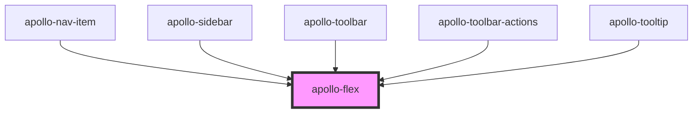

# apollo-flex

<!-- Auto Generated Below -->

## Properties

| Property     | Attribute     | Description                                                                                              | Type                                                                                                                                                                                                                                                                                                                                                                                                                                                                                                                                                                                                                         | Default     |
| ------------ | ------------- | -------------------------------------------------------------------------------------------------------- | ---------------------------------------------------------------------------------------------------------------------------------------------------------------------------------------------------------------------------------------------------------------------------------------------------------------------------------------------------------------------------------------------------------------------------------------------------------------------------------------------------------------------------------------------------------------------------------------------------------------------------- | ----------- |
| `alignItems` | `align-items` | Abreviação de prop no estilo `alignItems`                                                                | `"center" \| "flex-end" \| "flex-start" \| { base?: "flex-start" \| "center" \| "flex-end"; xs?: "flex-start" \| "center" \| "flex-end"; sm?: "flex-start" \| "center" \| "flex-end"; md?: "flex-start" \| "center" \| "flex-end"; lg?: "flex-start" \| "center" \| "flex-end"; }`                                                                                                                                                                                                                                                                                                                                           | `undefined` |
| `direction`  | `direction`   | Abreviação de prop no estilo `flexDirection`                                                             | `"column" \| "row" \| { base?: "column" \| "row"; xs?: "column" \| "row"; sm?: "column" \| "row"; md?: "column" \| "row"; lg?: "column" \| "row"; }`                                                                                                                                                                                                                                                                                                                                                                                                                                                                         | `undefined` |
| `grow`       | `grow`        | Abreviação de prop no estilo `flexGrow`                                                                  | `number \| { base?: number; xs?: number; sm?: number; md?: number; lg?: number; }`                                                                                                                                                                                                                                                                                                                                                                                                                                                                                                                                           | `undefined` |
| `justify`    | `justify`     | Abreviação de prop de estilo `justifyContent`                                                            | `"center" \| "flex-end" \| "flex-start" \| "space-around" \| "space-between" \| "space-evenly" \| { base?: "flex-start" \| "center" \| "flex-end" \| "space-between" \| "space-around" \| "space-evenly"; xs?: "flex-start" \| "center" \| "flex-end" \| "space-between" \| "space-around" \| "space-evenly"; sm?: "flex-start" \| "center" \| "flex-end" \| "space-between" \| "space-around" \| "space-evenly"; md?: "flex-start" \| "center" \| "flex-end" \| "space-between" \| "space-around" \| "space-evenly"; lg?: "flex-start" \| "center" \| "flex-end" \| "space-between" \| "space-around" \| "space-evenly"; }` | `undefined` |
| `reverse`    | `reverse`     | Pode mudar a ordem usando `reverse`                                                                      | `"column" \| "row" \| { base?: "column" \| "row"; xs?: "column" \| "row"; sm?: "column" \| "row"; md?: "column" \| "row"; lg?: "column" \| "row"; }`                                                                                                                                                                                                                                                                                                                                                                                                                                                                         | `undefined` |
| `spacer`     | `spacer`      | Cria um espaçamento igual entre os elementos. Mantendo o primeiro grudado no início e o último no final. | `boolean`                                                                                                                                                                                                                                                                                                                                                                                                                                                                                                                                                                                                                    | `undefined` |
| `wrap`       | `wrap`        | Abreviação de prop no estilo `flexWrap` adiciona o valor `wrap`                                          | `boolean`                                                                                                                                                                                                                                                                                                                                                                                                                                                                                                                                                                                                                    | `undefined` |

## Dependencies

### Used by

 - [apollo-nav-item](../../navigation/sidebar/nav-item)
 - [apollo-sidebar](../../navigation/sidebar)
 - [apollo-toolbar](../../surfaces/toolbar)
 - [apollo-toolbar-actions](../../surfaces/toolbar/actions)
 - [apollo-tooltip](../../tooltip)

### Graph

----------------------------------------------

PicPay Doc
