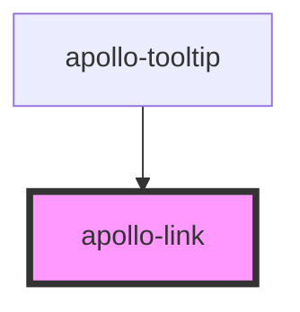

# apollo-link

<!-- Auto Generated Below -->

## Properties

| Property     | Attribute     | Description                                                                                                                            | Type                                                                                                                                                                                                                                                                                                                                                                                                                                                                                                                                                                                                                   | Default     |
| ------------ | ------------- | -------------------------------------------------------------------------------------------------------------------------------------- | ---------------------------------------------------------------------------------------------------------------------------------------------------------------------------------------------------------------------------------------------------------------------------------------------------------------------------------------------------------------------------------------------------------------------------------------------------------------------------------------------------------------------------------------------------------------------------------------------------------------------- | ----------- |
| `color`      | `color`       | Cor de conteúdo                                                                                                                        | `string \| { base?: string; xs?: string; sm?: string; md?: string; lg?: string; }`                                                                                                                                                                                                                                                                                                                                                                                                                                                                                                                                     | `'primary'` |
| `fontSize`   | `font-size`   | Para aumentar o tamanho da fonte do texto, você pode passar a propriedade `fontSize`.                                                  | `"2xl" \| "3xl" \| "4xl" \| "5xl" \| "6xl" \| "7xl" \| "base" \| "lg" \| "sm" \| "xl" \| "xs" \| { base?: "base" \| "xs" \| "sm" \| "lg" \| "xl" \| "2xl" \| "3xl" \| "4xl" \| "5xl" \| "6xl" \| "7xl"; xs?: "base" \| "xs" \| "sm" \| "lg" \| "xl" \| "2xl" \| "3xl" \| "4xl" \| "5xl" \| "6xl" \| "7xl"; sm?: "base" \| "xs" \| "sm" \| "lg" \| "xl" \| "2xl" \| "3xl" \| "4xl" \| "5xl" \| "6xl" \| "7xl"; md?: "base" \| "xs" \| "sm" \| "lg" \| "xl" \| "2xl" \| "3xl" \| "4xl" \| "5xl" \| "6xl" \| "7xl"; lg?: "base" \| "xs" \| "sm" \| "lg" \| "xl" \| "2xl" \| "3xl" \| "4xl" \| "5xl" \| "6xl" \| "7xl"; }` | `'base'`    |
| `hoverColor` | `hover-color` | Cor do link quando em estado hover                                                                                                     | `string \| { base?: string; xs?: string; sm?: string; md?: string; lg?: string; }`                                                                                                                                                                                                                                                                                                                                                                                                                                                                                                                                     | `'primary'` |
| `href`       | `href`        | Contém um URL ou fragmento de URL para o qual o hiperlink aponta. * Se esta propriedade for definida, uma tag âncora será renderizada. | `string`                                                                                                                                                                                                                                                                                                                                                                                                                                                                                                                                                                                                               | `undefined` |
| `isExternal` | `is-external` | Se `true`, o link será aberto em uma nova aba                                                                                          | `boolean`                                                                                                                                                                                                                                                                                                                                                                                                                                                                                                                                                                                                              | `undefined` |

## Dependencies

### Used by

 - [apollo-tooltip](../../tooltip)

### Graph

----------------------------------------------

PicPay Doc
