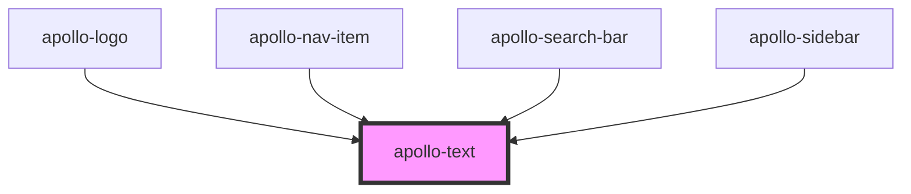

# apollo-text

<!-- Auto Generated Below -->

## Properties

| Property      | Attribute      | Description                                                                                                     | Type                                                                                                                                                                                                                                                                                                                                                                                                                                                                                                                                                                                                                                                                                                             | Default            |
| ------------- | -------------- | --------------------------------------------------------------------------------------------------------------- | ---------------------------------------------------------------------------------------------------------------------------------------------------------------------------------------------------------------------------------------------------------------------------------------------------------------------------------------------------------------------------------------------------------------------------------------------------------------------------------------------------------------------------------------------------------------------------------------------------------------------------------------------------------------------------------------------------------------- | ------------------ |
| `color`       | `color`        | Cor de conteúdo                                                                                                 | `string \| { base?: string; xs?: string; sm?: string; md?: string; lg?: string; }`                                                                                                                                                                                                                                                                                                                                                                                                                                                                                                                                                                                                                               | `'grayscale.base'` |
| `fontSize`    | `font-size`    | Para aumentar o tamanho da fonte do texto, você pode passar a propriedade `fontSize`.                           | `"2xl" \| "3xl" \| "4xl" \| "5xl" \| "6xl" \| "7xl" \| "base" \| "lg" \| "sm" \| "xl" \| "xs" \| { base?: "base" \| "xs" \| "sm" \| "lg" \| "xl" \| "2xl" \| "3xl" \| "4xl" \| "5xl" \| "6xl" \| "7xl"; xs?: "base" \| "xs" \| "sm" \| "lg" \| "xl" \| "2xl" \| "3xl" \| "4xl" \| "5xl" \| "6xl" \| "7xl"; sm?: "base" \| "xs" \| "sm" \| "lg" \| "xl" \| "2xl" \| "3xl" \| "4xl" \| "5xl" \| "6xl" \| "7xl"; md?: "base" \| "xs" \| "sm" \| "lg" \| "xl" \| "2xl" \| "3xl" \| "4xl" \| "5xl" \| "6xl" \| "7xl"; lg?: "base" \| "xs" \| "sm" \| "lg" \| "xl" \| "2xl" \| "3xl" \| "4xl" \| "5xl" \| "6xl" \| "7xl"; }`                                                                                           | `'base'`           |
| `fontWeight`  | `font-weight`  | Abreviação de propriedade de estilo `fontWeight`                                                                | `"black" \| "bold" \| "extrabold" \| "extralight" \| "light" \| "medium" \| "normal" \| "semibold" \| "thin" \| { base?: "thin" \| "extralight" \| "light" \| "normal" \| "medium" \| "semibold" \| "bold" \| "extrabold" \| "black"; xs?: "thin" \| "extralight" \| "light" \| "normal" \| "medium" \| "semibold" \| "bold" \| "extrabold" \| "black"; sm?: "thin" \| "extralight" \| "light" \| "normal" \| "medium" \| "semibold" \| "bold" \| "extrabold" \| "black"; md?: "thin" \| "extralight" \| "light" \| "normal" \| "medium" \| "semibold" \| "bold" \| "extrabold" \| "black"; lg?: "thin" \| "extralight" \| "light" \| "normal" \| "medium" \| "semibold" \| "bold" \| "extrabold" \| "black"; }` | `undefined`        |
| `isTruncated` | `is-truncated` | Passe `isTruncated` para renderizar reticência quando o texto exceder a largura.                                | `boolean`                                                                                                                                                                                                                                                                                                                                                                                                                                                                                                                                                                                                                                                                                                        | `undefined`        |
| `noOfLines`   | `no-of-lines`  | Da mesma forma, que o `isTruncated` passe a propriedade `noOfLines` e defina-o com o número de linhas desejado. | `number`                                                                                                                                                                                                                                                                                                                                                                                                                                                                                                                                                                                                                                                                                                         | `undefined`        |
| `textAlign`   | `text-align`   | Abreviação de prop no estilo `textAlign`                                                                        | `"center" \| "left" \| "right" \| { base?: "center" \| "left" \| "right"; xs?: "center" \| "left" \| "right"; sm?: "center" \| "left" \| "right"; md?: "center" \| "left" \| "right"; lg?: "center" \| "left" \| "right"; } \| { base?: TextAlign; xs?: TextAlign; sm?: TextAlign; md?: TextAlign; lg?: TextAlign; }`                                                                                                                                                                                                                                                                                                                                                                                            | `undefined`        |

## Dependencies

### Used by

 - [apollo-logo](../../logo)
 - [apollo-nav-item](../../navigation/sidebar/nav-item)
 - [apollo-search-bar](../../surfaces/toolbar/search-bar)
 - [apollo-sidebar](../../navigation/sidebar)

### Graph

----------------------------------------------

PicPay Doc
