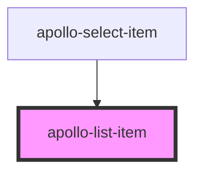

# apollo-menu

<!-- Auto Generated Below -->

## Properties

| Property        | Attribute        | Description                              | Type                     | Default      |
| --------------- | ---------------- | ---------------------------------------- | ------------------------ | ------------ |
| `disabled`      | `disabled`       | Desabilita o item                        | `boolean`                | `false`      |
| `role`          | `role`           | Adiciona uma role para o item            | `"menuitem" \| "option"` | `'menuitem'` |
| `secondaryText` | `secondary-text` | Adiciona um texto secundário para o item | `string`                 | `null`       |
| `select`        | `select`         | Se é componente de select                | `boolean`                | `false`      |
| `selected`      | `selected`       | Adiciona estilo de seleção ao item       | `boolean`                | `false`      |
| `value`         | `value`          | Adiciona um valor ao item                | `any`                    | `undefined`  |

## Events

| Event   | Description                      | Type               |
| ------- | -------------------------------- | ------------------ |
| `press` | Evento chamado ao clicar no item | `CustomEvent<any>` |

## Dependencies

### Used by

 - [apollo-select-item](../../select/item)

### Graph

----------------------------------------------

PicPay Doc
