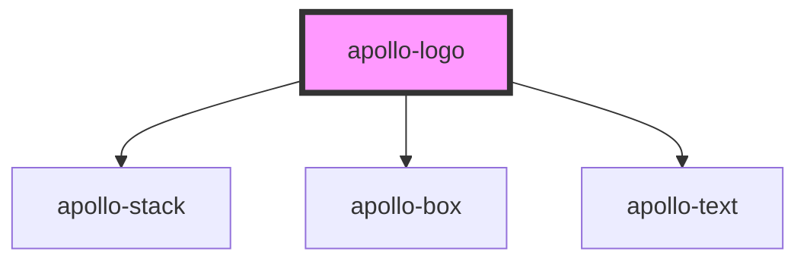

# apollo-logo

<!-- Auto Generated Below -->

## Properties

| Property   | Attribute  | Description           | Type     | Default     |
| ---------- | ---------- | --------------------- | -------- | ----------- |
| `nickname` | `nickname` | O nome curto do logo. | `string` | `undefined` |

## Dependencies

### Depends on

- [apollo-stack](../layouts/stack)
- [apollo-box](../layouts/box)
- [apollo-text](../layouts/text)

### Graph

----------------------------------------------

PicPay Doc
