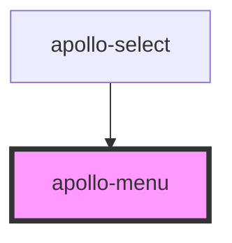

# apollo-menu

<!-- Auto Generated Below -->

## Properties

| Property      | Attribute      | Description                      | Type      | Default |
| ------------- | -------------- | -------------------------------- | --------- | ------- |
| `defaultOpen` | `default-open` | Estado de aberto/fechado do menu | `boolean` | `false` |
| `select`      | `select`       | Se é menu do select              | `boolean` | `false` |

## Events

| Event        | Description                                            | Type                                                             |
| ------------ | ------------------------------------------------------ | ---------------------------------------------------------------- |
| `itemSelect` | Evento disparado quando um item da lista é selecionado | `CustomEvent<{ value: any; index: number; item: HTMLElement; }>` |

## Methods

### `close() => Promise<void>`

Fecha o menu

#### Returns

Type: `Promise<void>`

### `open() => Promise<void>`

Abre o menu

#### Returns

Type: `Promise<void>`

### `toggle() => Promise<void>`

Alterna o estado do menu entre aberto/fechado

#### Returns

Type: `Promise<void>`

## Dependencies

### Used by

 - [apollo-select](../select)

### Graph

----------------------------------------------

PicPay Doc
