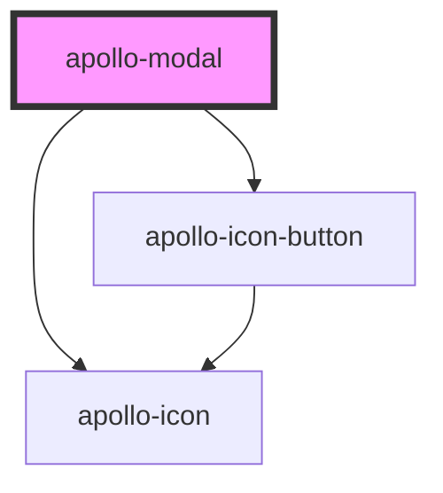

# apollo-modal

## Boas práticas

Em tablet e celulares não há o icone X para fechamento do modal. Certifique-se de que haja ao menos um botão para o fechamento do modal.

Obs: O modal também fecha caso haja clique na área externa.

<!-- Auto Generated Below -->

## Properties

| Property        | Attribute        | Description                                      | Type     | Default     |
| --------------- | ---------------- | ------------------------------------------------ | -------- | ----------- |
| `figure`        | `figure`         | Seta a versão Large do ícone para devices mobile | `string` | `undefined` |
| `icon`          | `icon`           | Ícone da dialog                                  | `string` | `undefined` |
| `modalSubtitle` | `modal-subtitle` | Subtitulo do dialog                              | `string` | `undefined` |
| `modalTitle`    | `modal-title`    | Título do dialog                                 | `string` | `undefined` |

## Events

| Event        | Description                                                   | Type                      |
| ------------ | ------------------------------------------------------------- | ------------------------- |
| `closeModal` | Evento disparado quando o botão de fechar o modal for clicado | `CustomEvent<MouseEvent>` |

## Methods

### `close() => Promise<void>`

API para fechar o dialog

#### Returns

Type: `Promise<void>`

### `open() => Promise<void>`

API para abrir o dialog

#### Returns

Type: `Promise<void>`

## Dependencies

### Depends on

- [apollo-icon](../icon)
- [apollo-icon-button](../icon-button)

### Graph

----------------------------------------------

PicPay Doc
