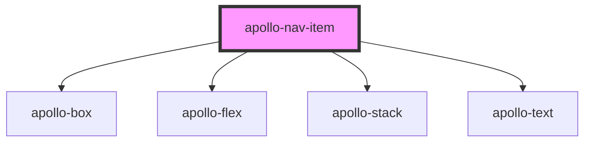

# apollo-nav-item

<!-- Auto Generated Below -->

## Properties

| Property     | Attribute    | Description                 | Type      | Default     |
| ------------ | ------------ | --------------------------- | --------- | ----------- |
| `disabled`   | `disabled`   | Mark this item as disabled. | `boolean` | `false`     |
| `selectable` | `selectable` | make the item selectable    | `boolean` | `false`     |
| `selected`   | `selected`   | Mark this item as selected. | `boolean` | `undefined` |

## Events

| Event          | Description                | Type                |
| -------------- | -------------------------- | ------------------- |
| `itemSelected` | click of list-item handler | `CustomEvent<void>` |

## Dependencies

### Depends on

- [apollo-box](../../../layouts/box)
- [apollo-flex](../../../layouts/flex)
- [apollo-stack](../../../layouts/stack)
- [apollo-text](../../../layouts/text)

### Graph

----------------------------------------------

PicPay Doc
