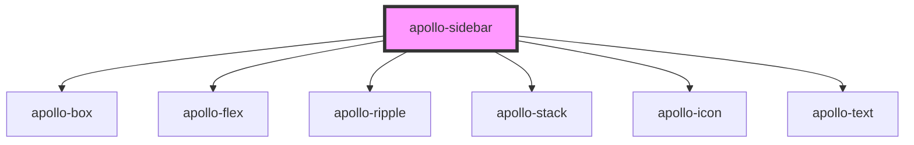

# apollo-navbar

<!-- Auto Generated Below -->

## Properties

| Property    | Attribute   | Description                                                             | Type      | Default |
| ----------- | ----------- | ----------------------------------------------------------------------- | --------- | ------- |
| `collapsed` | `collapsed` | Quando definido como verdadeiro, o `collapse` irá alternar para fechado | `boolean` | `false` |

## Events

| Event             | Description                                                    | Type               |
| ----------------- | -------------------------------------------------------------- | ------------------ |
| `apolloCollapsed` | Evento disparado quando o componente é alternado abert/fechado | `CustomEvent<any>` |

## Dependencies

### Depends on

- [apollo-box](../../layouts/box)
- [apollo-flex](../../layouts/flex)
- [apollo-ripple](../../ripple)
- [apollo-stack](../../layouts/stack)
- [apollo-icon](../../icon)
- [apollo-text](../../layouts/text)

### Graph

----------------------------------------------

PicPay Doc
