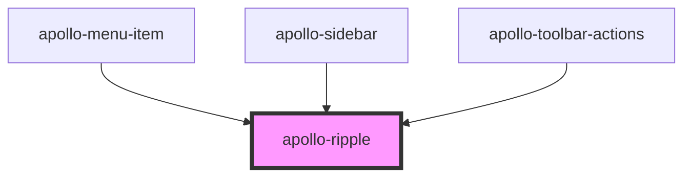

# apollo-ripple

<!-- Auto Generated Below -->

## Properties

| Property | Attribute | Description                                  | Type      | Default     |
| -------- | --------- | -------------------------------------------- | --------- | ----------- |
| `height` | `height`  | Abreviação de propriedade de estilo `height` | `string`  | `undefined` |
| `round`  | `round`   | Abreviação de propriedade de estilo `width`  | `boolean` | `false`     |
| `width`  | `width`   | Abreviação de propriedade de estilo `width`  | `string`  | `undefined` |

## Events

| Event         | Description     | Type               |
| ------------- | --------------- | ------------------ |
| `apolloClick` | Evento de keyUp | `CustomEvent<any>` |

## Dependencies

### Used by

 - [apollo-menu-item](../surfaces/toolbar/menu-item)
 - [apollo-sidebar](../navigation/sidebar)
 - [apollo-toolbar-actions](../surfaces/toolbar/actions)

### Graph

----------------------------------------------

PicPay Doc
