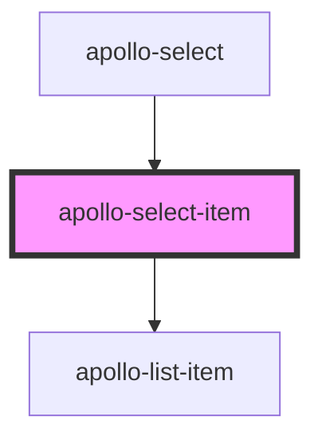

# apollo-select-item

<!-- Auto Generated Below -->

## Properties

| Property   | Attribute  | Description                        | Type      | Default     |
| ---------- | ---------- | ---------------------------------- | --------- | ----------- |
| `disabled` | `disabled` | Desabilita o item                  | `boolean` | `false`     |
| `selected` | `selected` | Adiciona estilo de seleção ao item | `boolean` | `false`     |
| `value`    | `value`    | Adiciona um valor ao item          | `any`     | `undefined` |

## Events

| Event   | Description                      | Type               |
| ------- | -------------------------------- | ------------------ |
| `press` | Evento chamado ao clicar no item | `CustomEvent<any>` |

## Dependencies

### Used by

 - [apollo-select](..)

### Depends on

- [apollo-list-item](../../list/item)

### Graph

----------------------------------------------

PicPay Doc
