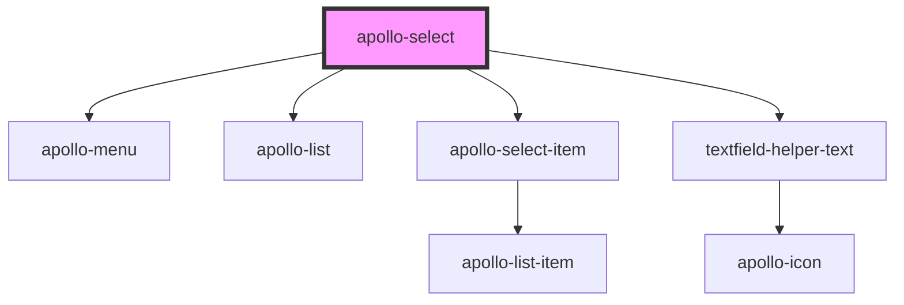

## apollo-select size

`size` property controls the size in height.

The default `size` property is set to `md`.

| Size | Design Token Reference | Height |
| ---- | ---------------------- | ------ |
| `sm` | small                  | 36px   |
| `md` | medium                 | 48px   |

 
 

<!-- Auto Generated Below -->

## Properties

| Property          | Attribute           | Description                                                                                        | Type                     | Default                     |
| ----------------- | ------------------- | -------------------------------------------------------------------------------------------------- | ------------------------ | --------------------------- |
| `disabled`        | `disabled`          | Habilita o estado desativado do Select                                                             | `boolean`                | `false`                     |
| `helperPersist`   | `helper-persist`    | Quando verdadeiro fixa a exibição do texto de ajuda mesmo que o campo não esteja em foco           | `boolean`                | `false`                     |
| `helperText`      | `helper-text`       | Texto de ajuda                                                                                     | `string`                 | `undefined`                 |
| `idElement`       | `id`                | Id único do Select                                                                                 | `string`                 | ``select__${this.rangeId}`` |
| `invalid`         | `invalid`           | Habilita o estado inválido do Select                                                               | `boolean`                | `false`                     |
| `label`           | `label`             | Label do Select \| Usado como placeholder ou float-label dependendo da configuração do componente  | `string`                 | `undefined`                 |
| `leadingIcon`     | `leading-icon`      | Ícone localizado na parte esquerda                                                                 | `boolean`                | `false`                     |
| `name`            | `name`              | Referência do Select nativo                                                                        | `string`                 | `undefined`                 |
| `noFloatingLabel` | `no-floating-label` | Deixa o label apenas como placeholder                                                              | `boolean`                | `false`                     |
| `required`        | `required`          | Marca o campo como obrigatório e adiciona um * no final do label/placeholder                       | `boolean`                | `false`                     |
| `size`            | `size`              | Ajusta o tamanho em altura do componente: sm = 36px, md = 48px                                     | `"md" \| "sm"`           | `'md'`                      |
| `success`         | `success`           | Habilita o estado válido do Select                                                                 | `boolean`                | `false`                     |
| `threshold`       | `threshold`         | Para fins de performance o evento inputChange só é disparado em uma quantidade delimitada de tempo | `number`                 | `200`                       |
| `value`           | `value`             | Seta o valor do Select                                                                             | `any`                    | `undefined`                 |
| `valueEmpty`      | `value-empty`       | Option do select padrão com valor vazio                                                            | `boolean`                | `false`                     |
| `variant`         | `variant`           | Estilo do Select                                                                                   | `"filled" \| "outlined"` | `'outlined'`                |

## Events

| Event          | Description                                        | Type                  |
| -------------- | -------------------------------------------------- | --------------------- |
| `apolloChange` | Evento disparado quando o valor do componente muda | `CustomEvent<string>` |

## Dependencies

### Depends on

- [apollo-menu](../menu)
- [apollo-list](../list)
- [apollo-select-item](item)
- [textfield-helper-text](../textfield/helper-text)

### Graph

----------------------------------------------

PicPay Doc
