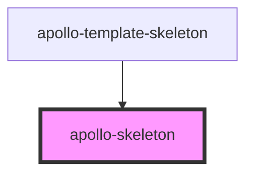

# apollo-skeleton

<!-- Auto Generated Below -->

## Properties

| Property        | Attribute        | Description                                                         | Type                                                  | Default      |
| --------------- | ---------------- | ------------------------------------------------------------------- | ----------------------------------------------------- | ------------ |
| `animation`     | `animation`      | Tipo de animação                                                    | `"false" \| "progress" \| "progress-dark" \| "pulse"` | `'progress'` |
| `count`         | `count`          | Quantidade de skeletons a serem carregados                          | `number`                                              | `1`          |
| `customStyles`  | `custom-styles`  | Custom css styles (background/margins/width/height etc.)            | `string \| { [key: string]: string; }`                | `{}`         |
| `height`        | `height`         | Altura do skeleton ex. 100px, 100%, auto etc.                       | `string`                                              | `null`       |
| `showWarnings`  | `show-warnings`  | Habilita os warnings para animações não suportadas                  | `boolean`                                             | `true`       |
| `size`          | `size`           | Tamanhos pré definidos, sobrescreve as propriedades width e height. | `"lg" \| "md" \| "sm" \| "xlg" \| "xxlg" \| "xxxlg"`  | `null`       |
| `templateWidth` | `template-width` | Seleciona valores padrões de um template definido no CSS            | `boolean`                                             | `false`      |
| `variant`       | `variant`        | Estilo do skeleton                                                  | `"circle" \| "pill" \| "rect" \| "text"`              | `'text'`     |
| `width`         | `width`          | Largura do skeleton ex. 100px, 100%, auto etc.                      | `string`                                              | `null`       |

## CSS Custom Properties

| Name                              | Description                                                           |
| --------------------------------- | --------------------------------------------------------------------- |
| `--apollo-skeleton-background`    | Skeleton background: Default: #e5e5e5                                 |
| `--apollo-skeleton-border-radius` | Skeleton border-radius: Default: 4px for the row, 50% for the circle  |
| `--apollo-skeleton-height`        | Skeleton height: Default: 20px for the row, 40px for the circle       |
| `--apollo-skeleton-margin-bottom` | Skeleton margin-bottom: Default: 10px for the row, 5px for the circle |
| `--apollo-skeleton-shimmer`       | Skeleton shimmer: Default: #f2f2f2                                    |
| `--apollo-skeleton-width`         | Skeleton width: Default: 100% for the row, 40px for the circle        |

## Dependencies

### Used by

 - [apollo-template-skeleton](template-skeleton)

### Graph

----------------------------------------------

PicPay Doc
