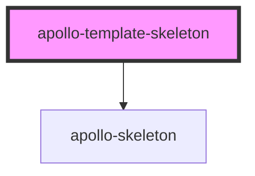

# apollo-template-skeleton

<!-- Auto Generated Below -->

## Properties

| Property       | Attribute       | Description                                              | Type                                                 | Default  |
| -------------- | --------------- | -------------------------------------------------------- | ---------------------------------------------------- | -------- |
| `align`        | `align`         | Alinhamento dos skeletons                                | `"center" \| "left" \| "right"`                      | `'left'` |
| `avatar`       | `avatar`        | Define se o template irá exibir o skeleton de avatar     | `boolean`                                            | `false`  |
| `avatarSize`   | `avatar-size`   | Tamanhos pré definidos para o avatar.                    | `"lg" \| "md" \| "sm" \| "xlg" \| "xxlg" \| "xxxlg"` | `'sm'`   |
| `count`        | `count`         | Quantidade de templates skeletons a serem carregados     | `number`                                             | `1`      |
| `showWarnings` | `show-warnings` | Habilita os warnings                                     | `boolean`                                            | `true`   |
| `textCount`    | `text-count`    | Quantidade de skeletons do tipo texto a serem carregados | `number`                                             | `1`      |
| `textHeight`   | `text-height`   | Altura do skeleton ex. 100px, 100%, auto etc.            | `string`                                             | `'16px'` |
| `textVariant`  | `text-variant`  | Estilo do template skeleton                              | `"pill" \| "rect" \| "text"`                         | `'text'` |

## Dependencies

### Depends on

- [apollo-skeleton](..)

### Graph

----------------------------------------------

PicPay Doc
