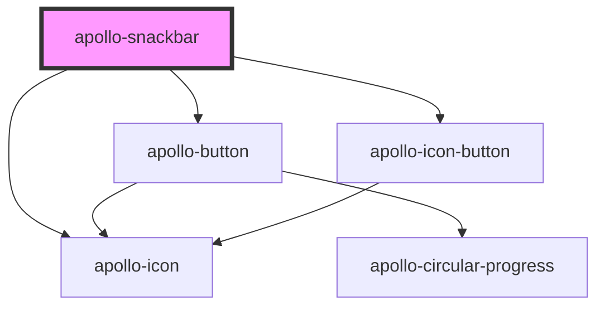

<!-- # apollo-snackbar

Done snackbar example

```html
<apollo-snackbar label="Insira aqui seu texto de feedback!" type="done"/>
```

<br />

Info snackbar example

```html
<apollo-snackbar label="Insira aqui seu texto de feedback!" type="info"/>
```

<br />

Warning snackbar example

```html
<apollo-snackbar label="Insira aqui seu texto de feedback!" type="warning"/>
```

<br />

Error snackbar example

```html
<apollo-snackbar label="Insira aqui seu texto de feedback!" type="error"/>
```

<br />

With an action button example

```html
<apollo-snackbar label="Insira aqui seu texto de feedback!" action-button-label="Texto de ação"/>
```

<br />

With emphasis example

```html
<apollo-snackbar label="Insira aqui seu texto de feedback!" action-button-label="Texto de ação" emphasis/>
```

<br />

With dismiss button example

```html
<apollo-snackbar label="Insira aqui seu texto de feedback!" show-dismiss-button/>
```

<br />

Leading example

```html
<apollo-snackbar label="Insira aqui seu texto de feedback!" variant="leading"/>
```

<br />

Stacked example

```html
<apollo-snackbar label="Insira aqui seu texto de feedback!" variant="stacked"/>
```

<br /> -->

<!-- Auto Generated Below -->


## Properties

| Property            | Attribute             | Description                                                         | Type                                       | Default     |
| ------------------- | --------------------- | ------------------------------------------------------------------- | ------------------------------------------ | ----------- |
| `actionButtonLabel` | `action-button-label` | Label do botão                                                      | `string`                                   | `undefined` |
| `emphasis`          | `emphasis`            | Ativa ênfase no snackbar                                            | `boolean`                                  | `undefined` |
| `label`             | `label`               | Label da snackbar                                                   | `string`                                   | `undefined` |
| `position`          | `position`            | Posição do snackbar                                                 | `"baseline" \| "leading"`                  | `'leading'` |
| `showDismissButton` | `show-dismiss-button` | Renderiza um botão com a função de fechar o snackbar quando clicado | `boolean`                                  | `false`     |
| `stacked`           | `stacked`             | Renderiza o snackbar no modo stacked                                | `boolean`                                  | `false`     |
| `type`              | `type`                | Tipo do snackbar                                                    | `"done" \| "error" \| "info" \| "warning"` | `'done'`    |


## Events

| Event               | Description                                         | Type                      |
| ------------------- | --------------------------------------------------- | ------------------------- |
| `actionButtonClick` | Evento disparado quando o botão de ação for clicado | `CustomEvent<MouseEvent>` |


## Methods

### `close() => Promise<void>`

API para fechar o snackbar

#### Returns

Type: `Promise<void>`


### `open(timeout?: number) => Promise<void>`

API para abrir o snackbar

#### Returns

Type: `Promise<void>`


### `setLabel(label: string) => Promise<void>`

API para alterar a label do snackbar

#### Returns

Type: `Promise<void>`


## Dependencies

### Depends on

- [apollo-icon](../icon)
- [apollo-button](../button)
- [apollo-icon-button](../icon-button)

### Graph


----------------------------------------------

PicPay Doc
