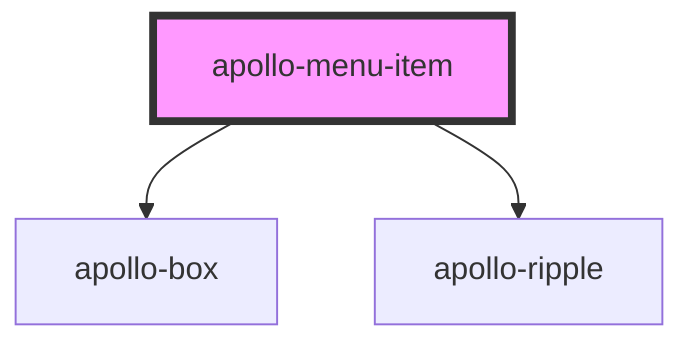

# apollo-menu-item

<!-- Auto Generated Below -->

## Properties

| Property     | Attribute     | Description                                                                                                                            | Type      | Default     |
| ------------ | ------------- | -------------------------------------------------------------------------------------------------------------------------------------- | --------- | ----------- |
| `href`       | `href`        | Contém um URL ou fragmento de URL para o qual o hiperlink aponta. * Se esta propriedade for definida, uma tag âncora será renderizada. | `string`  | `undefined` |
| `isExternal` | `is-external` | Se `true`, o link será aberto em uma nova aba                                                                                          | `boolean` | `undefined` |

## Dependencies

### Depends on

- [apollo-box](../../../layouts/box)
- [apollo-ripple](../../../ripple)

### Graph

----------------------------------------------

PicPay Doc
