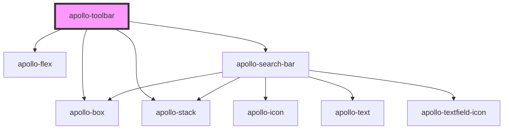

# apollo-toolbar

<!-- Auto Generated Below -->

## Properties

| Property   | Attribute   | Description                             | Type      | Default |
| ---------- | ----------- | --------------------------------------- | --------- | ------- |
| `isSearch` | `is-search` | Adiciona um campo de pesquisa principal | `boolean` | `false` |

## Events

| Event                | Description                                                                                               | Type                      |
| -------------------- | --------------------------------------------------------------------------------------------------------- | ------------------------- |
| `apolloSearchBlur`   | Evento disparado quando o campo perde o foco                                                              | `CustomEvent<FocusEvent>` |
| `apolloSearchChange` | Evento disparado quando o usuário termina de digitar e o tempo de atraso de envio do evento for concluído | `CustomEvent<InputEvent>` |
| `apolloSearchFocus`  | Evento disparado quando o campo recebe foco                                                               | `CustomEvent<FocusEvent>` |

## Dependencies

### Depends on

- [apollo-box](../../layouts/box)
- [apollo-flex](../../layouts/flex)
- [apollo-stack](../../layouts/stack)
- [apollo-search-bar](search-bar)

### Graph

----------------------------------------------

PicPay Doc
