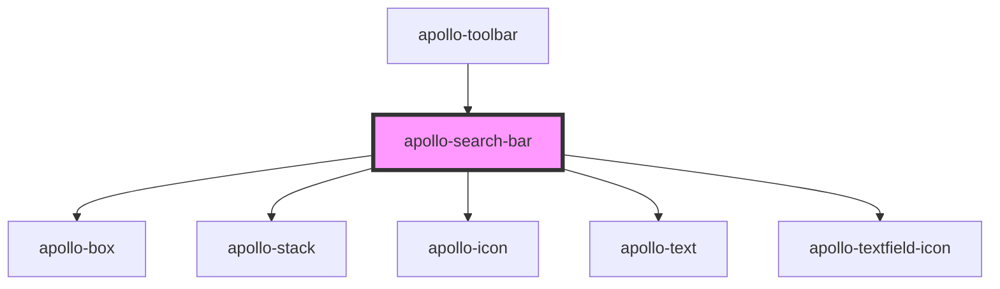

# apollo-search-bar

<!-- Auto Generated Below -->

## Properties

| Property | Attribute | Description           | Type     | Default     |
| -------- | --------- | --------------------- | -------- | ----------- |
| `value`  | `value`   | Seta o valor do input | `string` | `undefined` |

## Events

| Event          | Description                                                                                               | Type                      |
| -------------- | --------------------------------------------------------------------------------------------------------- | ------------------------- |
| `apolloBlur`   | Evento disparado quando o campo perde o foco                                                              | `CustomEvent<FocusEvent>` |
| `apolloChange` | Evento disparado quando o usuário termina de digitar e o tempo de atraso de envio do evento for concluído | `CustomEvent<any>`        |
| `apolloFocus`  | Evento disparado quando o campo recebe foco                                                               | `CustomEvent<FocusEvent>` |

## Dependencies

### Used by

 - [apollo-toolbar](..)

### Depends on

- [apollo-box](../../../layouts/box)
- [apollo-stack](../../../layouts/stack)
- [apollo-icon](../../../icon)
- [apollo-text](../../../layouts/text)
- [apollo-textfield-icon](../../../textfield/icon)

### Graph

----------------------------------------------

PicPay Doc
