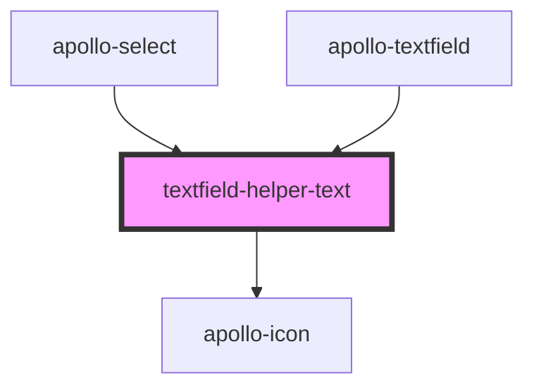

# textfield-helper-text

<!-- Auto Generated Below -->

## Properties

| Property  | Attribute | Description | Type      | Default |
| --------- | --------- | ----------- | --------- | ------- |
| `invalid` | `invalid` | invalid     | `boolean` | `false` |
| `persist` | `persist` | persist     | `boolean` | `false` |
| `text`    | `text`    | text        | `string`  | `''`    |

## Dependencies

### Used by

 - [apollo-select](../../select)
 - [apollo-textfield](..)

### Depends on

- [apollo-icon](../../icon)

### Graph

----------------------------------------------

PicPay Doc
