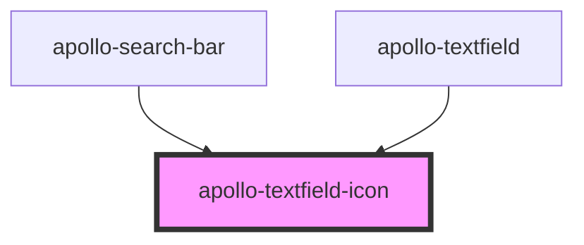

# textfield-icon

<!-- Auto Generated Below -->

## Properties

| Property    | Attribute    | Description | Type                      | Default     |
| ----------- | ------------ | ----------- | ------------------------- | ----------- |
| `ariaLabel` | `aria-label` | aria-label  | `string`                  | `''`        |
| `disabled`  | `disabled`   | disabled    | `boolean`                 | `false`     |
| `type`      | `type`       | type        | `"leading" \| "trailing"` | `'leading'` |

## Events

| Event         | Description     | Type                         |
| ------------- | --------------- | ---------------------------- |
| `apolloKeyUp` | Evento de keyUp | `CustomEvent<KeyboardEvent>` |

## Dependencies

### Used by

 - [apollo-search-bar](../../surfaces/toolbar/search-bar)
 - [apollo-textfield](..)

### Graph

----------------------------------------------

PicPay Doc
