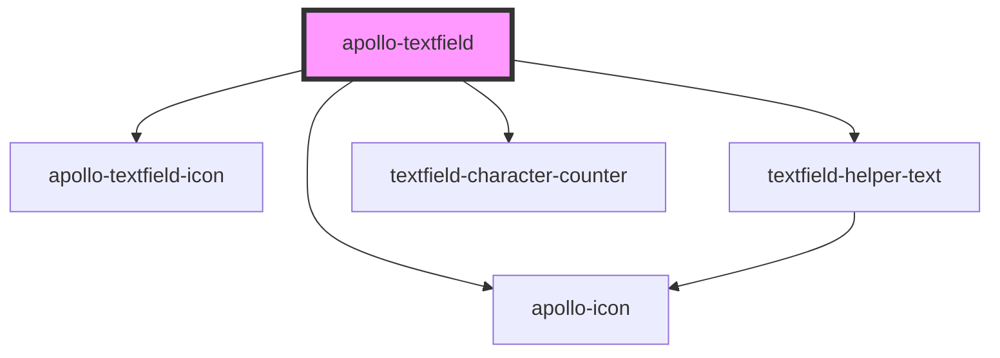

# apollo-textfield

<!-- Auto Generated Below -->

## Properties

| Property            | Attribute             | Description                                                                                                                                                                                                   | Type                                                                                  | Default                         |
| ------------------- | --------------------- | ------------------------------------------------------------------------------------------------------------------------------------------------------------------------------------------------------------- | ------------------------------------------------------------------------------------- | ------------------------------- |
| `characterCounter`  | `character-counter`   | Habilita a contagem de caracteres no canto inferior direito do input                                                                                                                                          | `boolean`                                                                             | `false`                         |
| `cols`              | `cols`                | Quando usado junto com o textarea ele limita a quantidade de colunas que o campo de texto deverá ter                                                                                                          | `number`                                                                              | `40`                            |
| `disabled`          | `disabled`            | Habilita o estado desativado do input                                                                                                                                                                         | `boolean`                                                                             | `false`                         |
| `helperPersist`     | `helper-persist`      | Quando verdadeiro fixa a exibição do texto de ajuda mesmo que o campo não esteja em foco                                                                                                                      | `boolean`                                                                             | `false`                         |
| `helperText`        | `helper-text`         | Texto de ajuda                                                                                                                                                                                                | `string`                                                                              | `undefined`                     |
| `idElement`         | `id`                  | Id único do input                                                                                                                                                                                             | `string`                                                                              | ``text_field__${this.rangeId}`` |
| `inputmode`         | `inputmode`           | Fornece uma dica para navegadores de dispositivos com teclados na tela para ajudá-los a decidir qual teclado exibir                                                                                           | `"decimal" \| "email" \| "none" \| "numeric" \| "search" \| "tel" \| "text" \| "url"` | `'text'`                        |
| `invalid`           | `invalid`             | Habilita o estado inválido do input                                                                                                                                                                           | `boolean`                                                                             | `false`                         |
| `label`             | `label`               | Label do input \| Usado como placeholder ou float-label dependendo da configuração do componente                                                                                                              | `string`                                                                              | `undefined`                     |
| `leadingIcon`       | `leading-icon`        | Ícone localizado na parte esquerda                                                                                                                                                                            | `boolean`                                                                             | `false`                         |
| `mask`              | `mask`                | Define as máscaras nas entradas                                                                                                                                                                               | `string`                                                                              | `undefined`                     |
| `maskVariant`       | `mask-variant`        | Define os tipos de máscaras já estabelecidas Formatos: cep - 99999-999 date - 99/99/9999 cpf - 999.999.999-99 cnpj - 99.999.999/9999-99 tel - (99) 9999-9999 cel - (99) 99999-9999 currency - 999.999.999,99  | `string \| string[]`                                                                  | `undefined`                     |
| `max`               | `max`                 | Quando usado junto com o type: number ele limita o valor máximo do campo nas interações do usuário com os botões de ação do tipo numérico, mas não faz validação se o usuário digitar uma informação inválida | `string`                                                                              | `undefined`                     |
| `maxLength`         | `max-length`          | Quando usado junto com o characterCounter ele limita a quantidade máxima de caracteres                                                                                                                        | `string`                                                                              | `undefined`                     |
| `min`               | `min`                 | Quando usado junto com o type: number ele limita o valor mínimo do campo nas interações do usuário, mas não faz validação se o usuário digitar uma informação inválida                                        | `string`                                                                              | `undefined`                     |
| `minLength`         | `min-length`          | Limita a quantidade minima de caracteres                                                                                                                                                                      | `string`                                                                              | `undefined`                     |
| `name`              | `name`                | Referência do input nativo                                                                                                                                                                                    | `string`                                                                              | `undefined`                     |
| `noFloatingLabel`   | `no-floating-label`   | Deixa o label apenas como placeholder                                                                                                                                                                         | `boolean`                                                                             | `false`                         |
| `readonly`          | `readonly`            | Habilita o estado read-only do input                                                                                                                                                                          | `boolean`                                                                             | `false`                         |
| `required`          | `required`            | Marca o campo como obrigatório e adiciona um * no final do label/placeholder                                                                                                                                  | `boolean`                                                                             | `false`                         |
| `rows`              | `rows`                | Quando usado junto com o textarea ele limita a quantidade de linhas que o campo de texto deverá ter                                                                                                           | `number`                                                                              | `8`                             |
| `size`              | `size`                | Ajusta o tamanho em altura do componente: sm = 36px, md = 48px                                                                                                                                                | `"md" \| "sm"`                                                                        | `'md'`                          |
| `step`              | `step`                | Quando usado junto com o type: number ele altera o valor de incremento e decremento nas interações do usuário com os botões de ação do tipo numérico                                                          | `string`                                                                              | `undefined`                     |
| `success`           | `success`             | Habilita o estado válido do input                                                                                                                                                                             | `boolean`                                                                             | `false`                         |
| `textarea`          | `textarea`            | Transforma o input em um textarea                                                                                                                                                                             | `boolean`                                                                             | `false`                         |
| `threshold`         | `threshold`           | Para fins de performance o evento inputChange só é disparado em uma quantidade delimitada de tempo                                                                                                            | `number`                                                                              | `200`                           |
| `trailingClearIcon` | `trailing-clear-icon` | Ícone localizado na parte direita para limpar o input                                                                                                                                                         | `boolean`                                                                             | `false`                         |
| `trailingIcon`      | `trailing-icon`       | Ícone localizado na parte direita                                                                                                                                                                             | `boolean`                                                                             | `false`                         |
| `type`              | `type`                | Tipo de dado do input \| Estende os tipos em formato de texto do HTMLInput                                                                                                                                    | `"date" \| "email" \| "number" \| "password" \| "search" \| "tel" \| "text" \| "url"` | `'text'`                        |
| `unmaskedValue`     | `unmasked-value`      | Value do input sem os caracteres especiais das máscaras Caracteres a serem removidos: - / ( ) . : space + ,                                                                                                   | `string`                                                                              | `''`                            |
| `value`             | `value`               | Seta o valor do input                                                                                                                                                                                         | `string`                                                                              | `undefined`                     |
| `valuePrefix`       | `value-prefix`        | Texto fixo localizado antes do campo de input                                                                                                                                                                 | `string`                                                                              | `''`                            |
| `valueSuffix`       | `value-suffix`        | Texto fixo localizado após o campo de input                                                                                                                                                                   | `string`                                                                              | `''`                            |
| `variant`           | `variant`             | Estilo do input                                                                                                                                                                                               | `"filled" \| "outlined"`                                                              | `'outlined'`                    |

## Events

| Event                | Description                                                                                               | Type                        |
| -------------------- | --------------------------------------------------------------------------------------------------------- | --------------------------- |
| `apolloBlur`         | Evento disparado quando o campo perde o foco                                                              | `CustomEvent<FocusEvent>`   |
| `apolloChange`       | Evento disparado quando o usuário termina de digitar e o tempo de atraso de envio do evento for concluído | `CustomEvent<string>`       |
| `apolloFocus`        | Evento disparado quando o campo recebe foco                                                               | `CustomEvent<FocusEvent>`   |
| `apolloPointerEnter` | Evento disparado quando o ponteiro está sob o componente                                                  | `CustomEvent<PointerEvent>` |
| `apolloPointerLeave` | Evento disparado quando o ponteiro sai do componente                                                      | `CustomEvent<PointerEvent>` |

## Dependencies

### Depends on

- [apollo-textfield-icon](icon)
- [apollo-icon](../icon)
- [textfield-helper-text](helper-text)
- [textfield-character-counter](character-counter)

### Graph

----------------------------------------------

PicPay Doc
