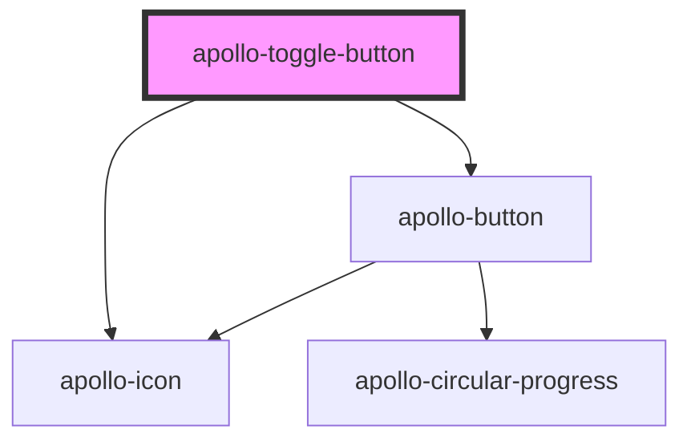

# apollo-toggle-button

<!-- Auto Generated Below -->

## Properties

| Property            | Attribute              | Description                             | Type           | Default     |
| ------------------- | ---------------------- | --------------------------------------- | -------------- | ----------- |
| `checked`           | `checked`              | Estado do botão                         | `boolean`      | `false`     |
| `size`              | `size`                 | Tamanho do botão                        | `"md" \| "sm"` | `'sm'`      |
| `toggleOffIcon`     | `toggle-off-icon`      | Ícone do botão com estado de toggle Off | `string`       | `undefined` |
| `toggleOffLabel`    | `toggle-off-label`     | Label do botão com estado de toggle off | `string`       | `undefined` |
| `toggleOffTypeIcon` | `toggle-off-type-icon` | Ícone do botão com estado de toggle Off | `string`       | `undefined` |
| `toggleOnIcon`      | `toggle-on-icon`       | Ícone do botão com estado de toggle on  | `string`       | `undefined` |
| `toggleOnLabel`     | `toggle-on-label`      | Label do botão com estado de toggle on  | `string`       | `undefined` |
| `toggleOnTypeIcon`  | `toggle-on-type-icon`  | Ícone do botão com estado de toggle on  | `string`       | `undefined` |

## Events

| Event          | Description                                 | Type                      |
| -------------- | ------------------------------------------- | ------------------------- |
| `toggleChange` | Evento disparado quando o toggle é clickado | `CustomEvent<MouseEvent>` |

## Methods

### `setChecked(checked: boolean) => Promise<void>`

API para alterar o toggle

#### Returns

Type: `Promise<void>`

## Dependencies

### Depends on

- [apollo-button](../button)
- [apollo-icon](../icon)

### Graph

----------------------------------------------

PicPay Doc
