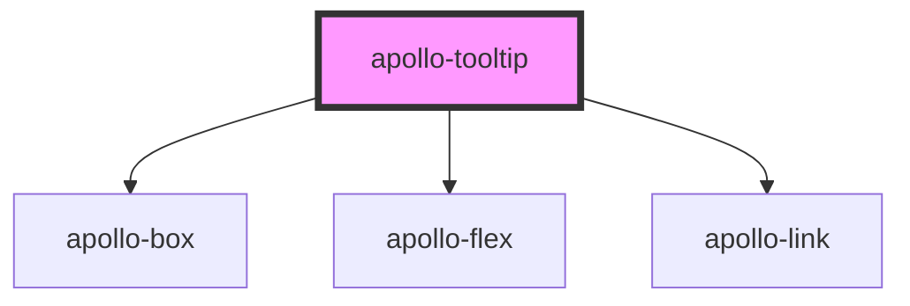

# apollo-tooltip

<!-- Auto Generated Below -->

## Properties

| Property      | Attribute     | Description                               | Type                                                                                                                                                                 | Default     |
| ------------- | ------------- | ----------------------------------------- | -------------------------------------------------------------------------------------------------------------------------------------------------------------------- | ----------- |
| `description` | `description` | Texto do tooltip                          | `string`                                                                                                                                                             | `undefined` |
| `isExternal`  | `is-external` | É um link externo?                        | `boolean`                                                                                                                                                            | `false`     |
| `linkLabel`   | `link-label`  | label do link                             | `string`                                                                                                                                                             | `undefined` |
| `linkUrl`     | `link-url`    | link                                      | `string`                                                                                                                                                             | `undefined` |
| `margin`      | `margin`      | Margin ao ocorrer overflow                | `number`                                                                                                                                                             | `0`         |
| `offset`      | `offset`      | Espaçamento do tooltip e o elemento chave | `number`                                                                                                                                                             | `0`         |
| `placement`   | `placement`   | Posição do tooltip                        | `"bottom" \| "bottom-end" \| "bottom-start" \| "left" \| "left-end" \| "left-start" \| "right" \| "right-end" \| "right-start" \| "top" \| "top-end" \| "top-start"` | `'bottom'`  |
| `size`        | `size`        | Tamanho do Potooltip                      | `"lg" \| "md" \| "sm"`                                                                                                                                               | `'sm'`      |
| `titleText`   | `title-text`  | Título do tooltip                         | `string`                                                                                                                                                             | `undefined` |

## Dependencies

### Depends on

- [apollo-box](../layouts/box)
- [apollo-flex](../layouts/flex)
- [apollo-link](../layouts/link)

### Graph

----------------------------------------------

PicPay Doc
