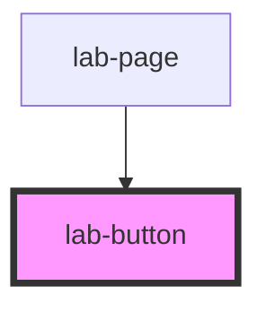

# lab-button

<!-- Auto Generated Below -->

## Properties

| Property    | Attribute    | Description                                  | Type                        | Default     |
| ----------- | ------------ | -------------------------------------------- | --------------------------- | ----------- |
| `isEditing` | `is-editing` | Habilita ou desabilita interação para edição | `boolean`                   | `false`     |
| `label`     | `label`      | Texto do botão                               | `string`                    | `undefined` |
| `type`      | `type`       | Tipo do botão                                | `"button" \| "button_link"` | `'button'`  |

## Dependencies

### Used by

 - [lab-page](../page)

### Graph

----------------------------------------------

PicPay Lab Doc
