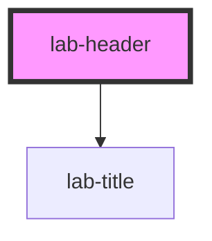

# labs-header

<!-- Auto Generated Below -->

## Properties

| Property    | Attribute    | Description                           | Type      | Default              |
| ----------- | ------------ | ------------------------------------- | --------- | -------------------- |
| `avatar`    | `avatar`     | Imagem do avatar                      | `string`  | `undefined`          |
| `banner`    | `banner`     | Imagem do banner                      | `string`  | `undefined`          |
| `isEditing` | `is-editing` | Indica se o componente está em edição | `boolean` | `false`              |
| `pageTitle` | `page-title` | Título do header                      | `string`  | `'Insira um título'` |

## Events

| Event             | Description                                                | Type                      |
| ----------------- | ---------------------------------------------------------- | ------------------------- |
| `backButtonClick` | Evento disparado quando o botão "voltar" for clicado       | `CustomEvent<MouseEvent>` |
| `edit`            | Evento disparado quando houver clique para editar o header | `CustomEvent<MouseEvent>` |

## Dependencies

### Depends on

- [lab-title](../title)

### Graph

----------------------------------------------

PicPay Lab Doc
