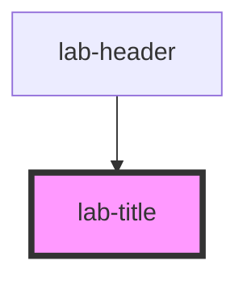

# lab-title

<!-- Auto Generated Below -->

## Properties

| Property    | Attribute    | Description                           | Type                    | Default              |
| ----------- | ------------ | ------------------------------------- | ----------------------- | -------------------- |
| `isEditing` | `is-editing` | Indica se o componente está em edição | `boolean`               | `false`              |
| `text`      | `text`       | Texto a ser exibido                   | `string`                | `'Insira seu texto'` |
| `type`      | `type`       | Variação do componente a ser exbida   | `"subtitle" \| "title"` | `'title'`            |

## Dependencies

### Used by

 - [lab-header](../header)

### Graph

----------------------------------------------

PicPay Lab Doc
